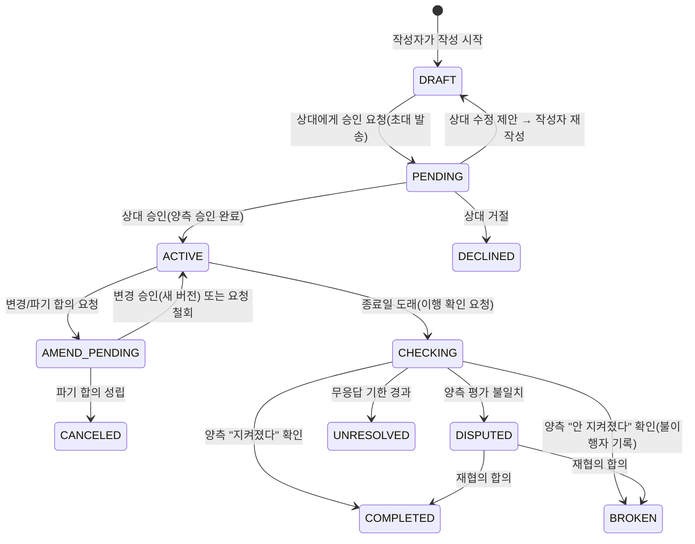

# 리틀핑거(Little Finger) 와이어프레임 디자인 요청서 v1.0

> **이 문서의 용도**: 디자인 AI Agent(Claude Design)에게 전달하는 와이어프레임 제작 요청서.
> 상위기획서 v1.1(2026-07-25 확정)에서 디자인에 필요한 컨텍스트만 발췌·재구성했다.
> **이 문서와 상위기획서가 충돌하면 상위기획서를 따르고, 이 문서에 없는 내용은 임의로 만들지 말고 §10의 규칙에 따라 질문으로 반환한다.**

| 항목 | 내용 |
|---|---|
| 문서 버전 | v1.0 (2026-07-25) |
| 요청자 | 대표(PO) |
| 수신자 | 디자인 AI Agent (Claude Design) |
| 과업 | MVP 전 화면의 **로파이(lo-fi) 와이어프레임** + 화면 간 플로우 연결도 |
| 상위 문서 | 01_상위기획서 v1.1 |

---

## 1. 서비스 컨텍스트 (30초 요약)

- **리틀핑거**는 두 사람이 합의한 약속을 기록하고, 잊지 않게 하고, 지켜지도록 돕는 **상호 약속 관리 서비스**다. 일정 조율 앱이 아니라 **"합의 내용 그 자체"를 기록**하는 앱이다.
- 핵심 루프: **작성 → 카톡 초대 → 상대 검토 → 상호 승인 → 확정 기록 → 리마인드 → 이행 확인 → 완료/불이행**.
- 타겟: 20–30대 커플·친구. 브랜드 모티프는 **"새끼손가락 걸기(핑키 프라미스)"** — 무겁지 않지만 진심인 약속.
- 톤: 가볍고 따뜻하게. **계약서·법률 문서처럼 보이면 실패다.** 단, 확정 기록 화면만은 "제대로 기록됐다"는 신뢰감을 줘야 한다(놀이와 신뢰의 균형).
- 수익모델은 광고(현재 비활성 슬롯만 설계). 법적 효력을 보증하는 서비스가 아니며 확정 화면에 디스클레이머가 붙는다.

## 2. 과업 정의

| 항목 | 내용 |
|---|---|
| 산출물 1 | 화면별 로파이 와이어프레임 (§5 화면 인벤토리 전체) |
| 산출물 2 | 화면 간 플로우 연결도 (§7의 3개 핵심 플로우 기준) |
| 산출물 3 | 약속 상세(SCR-A05)의 **상태별 변형** 와이어프레임 (§6 매트릭스 기준) |
| 기준 뷰포트 | 모바일 세로 360×800dp (앱·웹 동일). 태블릿/데스크톱 없음 |
| 플랫폼 | 안드로이드 앱(Material 3 컴포넌트 기준 권장) + 모바일 웹(수락용, 카톡 인앱 브라우저에서 열림) |
| 언어 | 한국어 (라벨은 §9 용어 사전 준수) |
| 피델리티 | 구조·배치·플로우 중심. 컬러·일러스트·비주얼 스타일은 이번 범위 아님 |
| 우선순위 | ① 수락 웹 플로우(W01→W03) ② 작성→초대(A03→A04) ③ 약속 상세 상태 변형(A05) ④ 나머지 |

우선순위 ①이 가장 중요한 이유: 초대받은 상대가 승인까지 도달하는 전환율이 서비스 성패를 좌우하는 핵심 KPI(목표 ≥50%)다. **상대는 앱 설치 없이, 아이폰이어도, 카톡 링크 클릭 → 웹에서 3분 내 승인**할 수 있어야 한다.

## 3. 플랫폼 × 역할 구조

두 개의 프로덕트 표면과 세 개의 역할이 있다. 같은 약속이라도 역할·표면에 따라 보이는 것과 가능한 행동이 다르다.

| 역할 | 정의 | 주 사용 표면 |
|---|---|---|
| **작성자** | 약속을 만들고 초대를 보내는 사람 | 안드로이드 앱 |
| **상대방** | 초대를 받아 검토·승인하고, 이후 이행 확인에 참여하는 사람 | 수락용 웹 (기기 무관. 앱 설치 시 앱에서도 가능) |
| **증인** | 초대받아 약속 내용을 열람하고 "확인 서명"만 하는 제3자. **판정 권한 없음.** 최대 2명 | 수락용 웹 |

참고: "지킬 사람"(이행 주체)은 역할과 별개 속성이다. 약속마다 작성자/상대방/둘 다 중에서 지정되며, 이행 확인 질문은 **양측 모두에게** 가되 평가 대상은 "지킬 사람"의 이행 여부다.

## 4. 기능 하이라키

와이어프레임이 커버해야 하는 기능 전체 구조. F-ID는 상위기획서와 동일하며 임의 추가·삭제 금지.

```
리틀핑거 MVP
├─ 1. 계정 (F-01)
│   ├─ 카카오 로그인 (앱 / 수락 웹 동일 계정 체계)
│   └─ 온보딩 (서비스 소개, 최초 1회)
├─ 2. 약속 생성·합의  ★ 핵심 루프 전반부
│   ├─ 약속 작성 (F-02) — 앱
│   │   └─ 필드: 제목 / 내용 / 카테고리(습관·내기·금전·기타) / 종료일(필수)
│   │            / 지킬 사람(작성자·상대·둘 다) / 보상·패널티(선택, 프리셋+자유입력) / 증인 사용 여부
│   ├─ 초대·상호 승인 (F-03) — 카톡 링크(1회용·72시간 만료) → 웹에서 [승인/거절/수정 제안]
│   └─ 확정 기록 (F-04) — 확정 시각·양측 승인 로그 표시 + 디스클레이머 고지
├─ 3. 증인 (F-05) — 초대(최대 2명) / 열람 / 확인 서명
├─ 4. 이행 관리  ★ 핵심 루프 후반부
│   ├─ 리마인드·알림 (F-06) — D-7/D-3/D-1/D-Day, 앱=푸시·알림함 / 웹 참여자=이메일(선택)
│   ├─ 이행 확인 (F-07) — 종료일 도래 시 양측에 "지켜졌나요?" → 일치/불일치/무응답 분기
│   └─ 이행 증빙 첨부 (F-08) — 이행 확인 시 사진 첨부(선택), 상대·증인에게 공개
├─ 5. 신뢰 (F-09) — 이행률 프로필 (완료·불이행 기반, 분쟁·무응답은 별도 건수 표기)
├─ 6. 탐색·관리
│   ├─ 홈·약속 목록 (F-10) — 진행 중/대기/완료 탭, 임박(D-3 이내) 상단 고정
│   └─ 변경·파기 합의 (F-11) — 요청 → 상대 승인 시 성립, 버전 이력 열람
└─ 7. 수익 (F-12) — 홈 하단 네이티브 광고 1구좌 (MVP에선 자리만, 비활성 상태로 표시)
```

## 5. 화면 인벤토리

각 화면은 "목적 1개 + 주 CTA 1개" 원칙. 필수 요소는 빠뜨리지 말 것(배치는 재량).

### 5-1. 안드로이드 앱 (SCR-A)

| ID | 화면 | 목적 | 필수 요소 | 주 CTA |
|---|---|---|---|---|
| SCR-A00 | 온보딩 | 서비스 가치 3장 이내 소개 | 핵심 루프 요약, 건너뛰기 | 시작하기 |
| SCR-A01 | 로그인 | 진입 | 카카오 로그인 버튼(단일), 약관 동의 | 카카오로 시작하기 |
| SCR-A02 | 홈·약속 목록 | 내 약속 현황 파악 | 탭(진행 중/대기/완료), 임박 약속 고정 영역, 각 카드에 상태 라벨+D-Day, **빈 상태(첫 약속 유도)**, 광고 슬롯 자리(하단, 비활성 표기), FAB | 약속 만들기(FAB) |
| SCR-A03 | 약속 작성 | F-02 필드 입력 | §4의 작성 필드 전부, 보상/패널티 프리셋 선택 UI, 종료일 피커 | 상대에게 보내기 |
| SCR-A04 | 초대 전송·대기 | 초대 발송과 대기 상태 안내 | 카톡 공유 시트 진입점, 만료 카운트다운(72시간), 재발송 버튼(만료 시) | 카카오톡으로 초대 보내기 |
| SCR-A05 | 약속 상세 | 약속의 모든 상태를 표현하는 핵심 화면 | 상태 라벨, 내용 전문, 종료일·D-Day, 보상/패널티, 참여자·증인 목록과 승인 로그(시각 포함), 버전 이력 진입점 | 상태별로 다름(§6) |
| SCR-A06 | 이행 확인 입력 | "지켜졌나요?" 응답 | 예/아니오 선택, 증빙 사진 첨부(선택), 상대 응답 대기 상태 표시 | 제출 |
| SCR-A07 | 알림함 | 알림 목록 | 유형별 알림(승인 요청/확정/리마인드/이행 확인/변경 요청), 읽음 처리 | (목록 탭) |
| SCR-A08 | 마이·신뢰 프로필 | 내 이행률과 설정 | 이행률(%), 완료·불이행 건수, **분쟁·무응답 별도 건수**, 리마인드 설정, 약관·디스클레이머 | — |
| MOD-01 | 변경·파기 요청 모달 | F-11 요청 작성 | 변경 내용 입력 또는 파기 사유(선택), 상대 승인 필요 안내 | 요청 보내기 |
| MOD-02 | 증인 초대 모달 | F-05 | 카톡 공유, 남은 슬롯 표시(최대 2명) | 증인 초대하기 |
| MOD-03 | 완료 축하 | COMPLETED 전환 순간 | 축하 메시지, 이행률 변화, 새 약속 제안 | 새 약속 만들기 |

### 5-2. 수락용 웹 (SCR-W) — 광고 전면 금지, 3분 내 완주가 목표

| ID | 화면 | 목적 | 필수 요소 | 주 CTA |
|---|---|---|---|---|
| SCR-W01 | 초대 랜딩 | 클릭 직후 신뢰 형성 | "○○님이 약속을 보냈어요", 약속 제목 미리보기, 만료 카운트다운, 서비스 한 줄 소개 | 카카오 로그인하고 내용 보기 |
| SCR-W02 | 약속 검토 | 전문 확인 후 의사결정 | 내용 전문, 종료일, 보상/패널티, 지킬 사람, 디스클레이머, **3택: 승인/수정 제안/거절**(수정 제안 시 의견 입력) | 승인하기 |
| SCR-W03 | 승인 완료 | 확정 안내 + 이후 연결 | 확정 스탬프(양측 승인·시각), 이메일 등록(선택, 리마인드용), 앱 설치 유도 배너 | 앱에서 계속하기(보조: 웹으로 볼게요) |
| SCR-W04 | 참여 약속 열람·응답 | 재접근 시 이행 확인·변경 응답 | 약속 현황, 이행 확인 입력(A06과 동일 구성), 변경 요청 응답 | 상황별 |
| SCR-W05 | 증인 확인 | 증인 열람·서명 | 약속 전문(읽기 전용), "내용을 확인했습니다" 서명, 증인 권한 안내(판정 아님) | 확인 서명 |
| SCR-W06 | 링크 무효·만료 안내 | 만료(72시간)·사용된 링크 처리 | 사유 안내, "작성자에게 재발송 요청" 안내 | — |

## 6. 약속 생애주기 (상태 정의) — 상위기획서 §6 원문

상태 이름은 코드·DB·디자인 파일에서 **아래 영문 그대로** 사용한다(화면 표시용 한국어 라벨은 §9).



| 상태 | 정의 | 핵심 정책 |
|---|---|---|
| DRAFT | 작성자가 작성 중, 상대 미발송 | 작성자만 열람·수정·삭제 가능 |
| PENDING | 상대 승인 대기 | 초대 링크는 1회용 + 72시간 만료. 만료 시 재발송 가능 |
| ACTIVE | 양측 승인 완료, 확정 기록 | 내용 불변. 확정 시각·양측 승인 로그·내용 해시 저장. 리마인드 가동 |
| AMEND_PENDING | 변경 또는 파기 합의 진행 중 | 상대 동의 시에만 성립. 원본 버전 이력 보존 |
| CHECKING | 종료일 도래, 양측 이행 확인 입력 대기 | 증빙 첨부 가능. 응답 기한(7일) 내 리마인드 반복 |
| COMPLETED | 이행 완료 | 이행률 반영. 축하 피드백(공유 유도) |
| BROKEN | 불이행 확정 | 기록된 패널티 표시. 이행률 반영 |
| DISPUTED | 이행 평가 불일치 | 양측 주장 + 증인 확인 여부를 나란히 기록만 함(판정 없음). 재협의로만 종결 |
| UNRESOLVED | 이행 확인 무응답으로 미확정 종결 | 이행률 제외, 프로필에 "무응답 종결 n건" 별도 표기 |
| DECLINED / CANCELED | 거절 / 합의 파기 | 이행률 제외. 기록은 당사자에게만 보존 |

### 상태 × 화면 × 역할 매트릭스 (SCR-A05 / SCR-W04 변형 설계의 기준)

| 상태 | 목록 카드 표시 | 상세 화면 핵심 요소 | 작성자 가능 액션 | 상대방 가능 액션 | 증인 |
|---|---|---|---|---|---|
| DRAFT | "작성 중" (작성자에게만 노출) | 편집 가능한 작성 폼 | 수정·삭제·초대 발송 | — (아직 안 보임) | — |
| PENDING | "승인 대기" + 만료 카운트다운 | 읽기 전용 내용 + 대기 안내 | 재발송(만료 시) ※철회는 오픈 포인트 O-D1 | 승인 / 수정 제안 / 거절 (웹) | — |
| ACTIVE | D-Day 카운트 | 확정 스탬프(확정 시각·양측 승인 로그), 전문, 보상/패널티, 증인 목록, 버전 이력 | 변경·파기 요청, 증인 초대 | 좌동 (웹에서도 가능) | 열람 + 확인 서명 |
| AMEND_PENDING | "변경 협의 중" | 변경 전/후 비교 뷰 | 요청 철회 (요청자인 경우) | 변경 승인 / 거절 | 열람 |
| CHECKING | "이행 확인 필요" 강조 | "지켜졌나요?" 질문 카드, 내 응답/상대 응답 상태, 증빙 첨부 | 이행 확인 제출 | 이행 확인 제출 (웹) | 열람 |
| COMPLETED | "완료" | 결과 요약, 증빙, 축하(MOD-03 경유) | 공유, 새 약속 만들기 | 좌동 | 열람 |
| BROKEN | "불이행" | 결과 + **기록된 패널티 강조 표시** | 열람 | 열람 | 열람 |
| DISPUTED | "의견 불일치" | 양측 주장 나란히 배치, 증인 확인 여부 참고 표시, 재협의 안내 | 재협의 요청/응답 | 좌동 | 열람 |
| UNRESOLVED | "미확정 종결" | 무응답 종결 안내 | 열람 | 열람 | 열람 |
| DECLINED / CANCELED | "거절됨" / "파기됨" | 종결 안내(사유는 선택 입력) | 열람 | 열람 | — |

주의: DISPUTED 화면에서 앱은 **절대 어느 쪽이 옳은지 표시하지 않는다**(서비스 원칙 P1 "기록자이지 심판이 아니다"). 재협의를 중립적으로 안내할 것.

## 7. 와이어프레임으로 표현할 핵심 플로우 3개

1. **상대방 수락 플로우 (최우선)**: 카톡 링크 클릭 → W01 랜딩 → 카카오 로그인 → W02 검토 → [승인] → W03 완료(이메일 등록·앱 유도) / 분기: [수정 제안] → 작성자에게 회귀 안내, [거절] → 종결 안내, 만료 링크 → W06
2. **작성자 생성 플로우**: A01 로그인 → A02 홈(빈 상태) → A03 작성 → A04 카톡 초대 전송 → (상대 승인 푸시 수신) → A05 상세(ACTIVE, 확정 스탬프)
3. **이행 확인 플로우**: 종료일 도래 푸시 → A06 이행 확인(증빙 첨부 포함) → 분기 ① 양측 일치 → MOD-03 축하(COMPLETED) ② 불일치 → A05 상세(DISPUTED 변형) ③ 상대 무응답 7일 → A05 상세(UNRESOLVED 변형)

## 8. 디자인 원칙·제약 (위반 금지)

- **신뢰 순간에 광고 없음**: 작성·검토·승인·확정·이행 확인 화면과 수락용 웹 전체에 광고 요소 배치 금지. 광고 자리는 오직 SCR-A02 홈 목록 하단 1구좌(비활성 표기).
- **상대방 3분 완주**: W01→W03은 스크롤 최소화, 화면당 주 CTA 1개, 가입 폼 없음(카카오 로그인만).
- **계약서처럼 보이지 않게**: 도장·서류·법원 메타포 대신 새끼손가락 걸기 모티프. 단 ACTIVE 확정 스탬프 영역은 "제대로 기록됐다"는 신뢰감을 줄 것.
- **디스클레이머 고지 위치 고정**: W02 검토 화면과 A05/W03 확정 영역에 다음 문구 노출(상위기획서 §10 확정 문구, 변경 금지) — "리틀핑거의 약속 기록은 공증이나 전자계약 서비스가 아니며, 법적 효력을 보증하지 않습니다. 다만 양측의 승인 이력과 시각 정보는 분쟁 시 참고 자료로 활용될 수 있습니다."
- **상태 라벨은 §9 용어 사전의 한국어 라벨만 사용**, 새 용어 발명 금지.
- 카카오 로그인 버튼은 카카오 공식 버튼 가이드 형태를 가정한 플레이스홀더로.
- 접근성: 터치 타깃 최소 48dp, 상태를 색상만으로 구분하지 말 것(라벨 병기 — 와이어프레임 단계에서는 라벨이 기본).

## 9. 용어 사전 (화면 표시 라벨)

| 코드 용어 | 화면 라벨(한국어) | 비고 |
|---|---|---|
| Promise | 약속 | "계약" 금지 |
| Creator / Partner / Witness | 작성자 / 상대방 / 증인 | |
| 지킬 사람 | 지킬 사람 | 이행 주체 (작성자·상대방·둘 다) |
| Reward / Penalty | 보상 / 벌칙 | "패널티"보다 "벌칙" 사용(가벼운 톤) |
| DRAFT / PENDING / ACTIVE | 작성 중 / 승인 대기 / 진행 중 | |
| AMEND_PENDING | 변경 협의 중 | |
| CHECKING | 이행 확인 중 | |
| COMPLETED / BROKEN | 완료 / 불이행 | |
| DISPUTED / UNRESOLVED | 의견 불일치 / 미확정 종결 | |
| DECLINED / CANCELED | 거절됨 / 파기됨 | |
| 이행률 | 약속 지킴율 | 프로필 표시명 (오픈 포인트 O-D3) |

## 10. 디자인 에이전트 작업 규칙

1. **기능·화면·상태를 임의로 추가하거나 빼지 않는다.** 이 문서의 F-ID, SCR-ID, 상태명이 전부다.
2. 판단이 필요한데 이 문서에 근거가 없으면, 임의로 정하지 말고 **산출물 말미에 "질문 목록(Q-1, Q-2…)"으로 반환**한다.
3. 각 와이어프레임에는 SCR-ID를 표기하고, 상태 변형은 `SCR-A05/ACTIVE`처럼 상태명을 병기한다.
4. 마이크로카피(버튼·안내 문구)는 제안해도 좋으나 §8 디스클레이머 문구와 §9 라벨은 변경 금지.
5. 산출 순서는 §2의 우선순위를 따른다. 우선순위 ①~③ 완료 후 ④로 진행.

## 11. 오픈 포인트 (PO 결정 대기 — 아래 기본안으로 우선 진행)

| # | 이슈 | 기본안 |
|---|---|---|
| O-D1 | PENDING 상태에서 작성자가 초대를 철회(회수)할 수 있는가 | 와이어프레임에는 **철회 버튼 없이** 진행, 재발송만 표현 |
| O-D2 | 거절(DECLINED) 시 상대방의 사유 입력 여부 | 선택 입력(생략 가능)으로 표현 |
| O-D3 | 이행률의 표시명("약속 지킴율" vs "이행률") | "약속 지킴율"로 표기 |
| O-D4 | 홈 탭 구성(진행 중/대기/완료) vs 단일 리스트+필터 | 탭 3개 기본안으로 |
