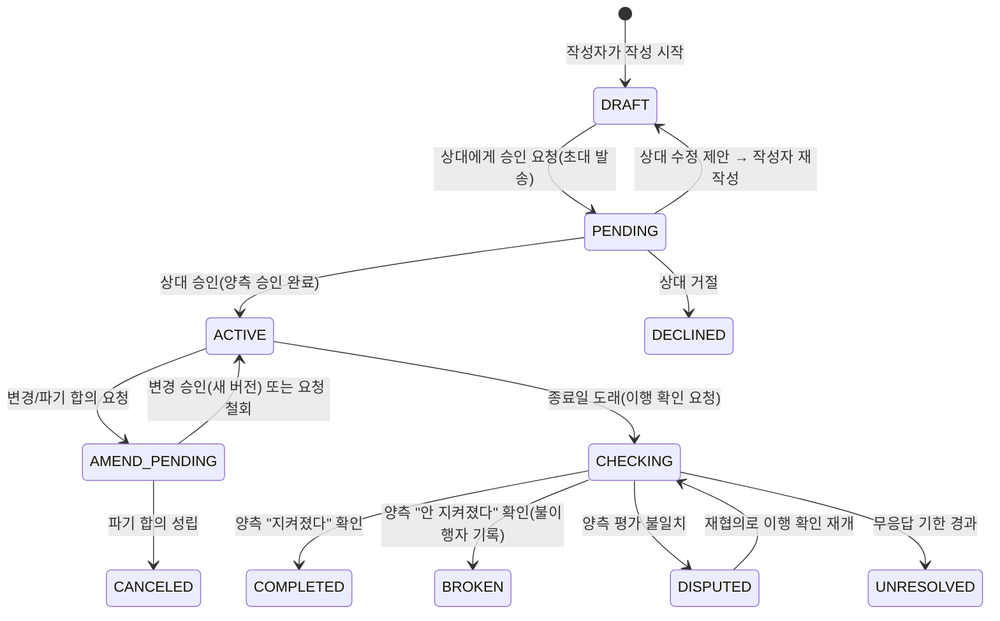

# 리틀핑거(Little Finger) 상위기획서 v1.2

| 항목 | 내용 |
|---|---|
| 서비스명 | **리틀핑거 (Little Finger)** — 새끼손가락 걸고 하는 약속(핑키 프라미스)에서 따온 이름 (구 가칭: Promiss) |
| 문서 버전 | v1.2 (2026-07-25) |
| 작성 목적 | 서비스의 전략·컨셉·범위를 확정하는 최상위 기준 문서 |
| 독자 | 대표(PO), AI 코딩 에이전트 |
| 문서 지위 | 모든 후속 문서(세부기능명세서, AI Agent 코딩 가이드)는 본 문서와 충돌 시 본 문서를 따른다 |
| 후속 문서 | 02_세부기능명세서, 03_기술스택_비교분석, 04_AI-Agent_코딩가이드 |

**변경 이력**

| 버전 | 일자 | 내용 |
|---|---|---|
| v1.0 | 2026-07-24 | 최초 작성. 핵심 전략 4건(D1~D4) 사용자 컨펌 |
| v1.1 | 2026-07-25 | 서비스명 '리틀핑거' 확정(D5), **D3 변경: 웹 우선 → 안드로이드 앱 우선 + 초대 수락용 웹**, 정책값 6건(구 오픈 이슈 O-1~O-6) 확정 반영 |
| v1.2 | 2026-07-25 | **N-3 확정: React Native + Expo**(근거 03_기술스택_비교분석). 후속 문서 번호 03→04 정정, 상태도 `DISPUTED → CHECKING` 정정, 용어 통일(이행률→약속 지킴율 / 패널티→벌칙), UNRESOLVED 표기 '무응답 종결'→'미확정 종결', F-09 분모를 '내가 지킬 사람인 약속'으로 한정 + 최소 표본 3건 |

---

## 1. 서비스 정의

**한 줄 정의**: 두 사람이 합의한 약속을 기록하고, 잊지 않게 하고, 지켜지도록 돕는 **상호 약속 관리 서비스**.

기존 앱들이 "약속 시간 잡기(일정 조율)"나 "혼자 하는 목표 달성"을 다룬다면, 리틀핑거는 **"두 사람 사이에 오간 합의 내용 그 자체"**를 다룬다. 카톡 대화 속에 흩어져 잊히는 약속을, 양측이 승인한 하나의 기록으로 남기고 끝까지 이행되도록 돕는다. 브랜드 모티프는 "새끼손가락 걸기" — 무겁지 않지만 진심인 약속의 상징이며, 서비스 톤·로고·카피의 기준으로 삼는다.

**핵심 가치 3가지**

1. **신뢰할 수 있는 기록** — 상호 승인 + 확정 후 변경 불가 + 시각 기록(타임스탬프)으로 "그런 말 한 적 없다"를 없앤다.
2. **이행 지원** — 종료일 기반 리마인드와 상호 이행 확인 루프로 약속이 실제로 지켜지게 한다.
3. **관계 친화적** — 보상/벌칙를 재미 요소로 활용하고, 계약서처럼 무겁지 않은 톤을 유지해 관계를 해치지 않는다.

---

## 2. 문제 정의와 시장 기회

### 2-1. 문제

- 개인 간 약속은 대부분 말이나 메신저로 이뤄져 **흩어지고, 잊히고, 나중에 기억이 엇갈린다.**
- 약속을 문서로 남기자니 각서/계약서는 **관계에 부담**을 주고, 전자계약 서비스는 기업용이라 무겁고 비싸다.
- 약속을 지키게 만드는 장치(리마인드, 상호 확인, 제3자 증인)가 일상 수준에서는 존재하지 않는다.

### 2-2. 시장 공백 (2026-07 조사 기준)

| 인접 시장 | 대표 서비스 | 다루는 것 | 리틀핑거와의 차이 |
|---|---|---|---|
| 약속 잡기(일정 조율) | 이때, 모여봐요, MEETPING, 캘링 | 만날 "시간·장소" 조율 | 합의 "내용"은 다루지 않음 |
| 자기 목표 달성(커밋먼트) | 챌린저스(국내), stickK·Beeminder·Forfeit(해외) | 혼자 세운 목표 + 벌금 | 1인용. 두 사람의 상호 약속 아님 |
| 전자계약/전자서명 | 모두싸인, 글로싸인 | 법적 효력 있는 계약 문서 | 기업용·문서 중심·유료. 일상 약속엔 과함 |

**결론: "2인 상호 약속의 기록과 이행 관리"는 국내외 모두 사실상 공백 영역이다.**

참고 시사점:

- 챌린저스는 순수 커밋먼트(돈 걸기) 모델에서 쇼핑 리워드 앱으로 피벗 → 커밋먼트 단일 BM의 수익화 한계를 시사. 리틀핑거는 금전 예치 모델을 배제한다(§11).
- 전자문서도 당사자 확인 + 시각/기기 기록(감사추적)을 갖추면 민사 증거로 활용될 수 있음(전자문서법·전자서명법) → 추후 "강화 모드" 설계의 근거(§13).
- 2026 모바일 트렌드는 AI 기능 내장이 기본값 → AI 약속 문구 다듬기를 v1.1 릴리스에 배치(§13).
- 갤럽 2025 기준 20대는 아이폰 비중이 절반 수준으로 높음 → 안드로이드 앱 단독으로는 타겟 쌍(커플·친구)의 다수가 배제됨. **초대받은 상대는 기기 무관하게 웹으로 참여**하는 구조로 해결(D3).

---

## 3. 확정 전략 (의사결정 기록)

> 아래 결정은 사용자(대표) 컨펌으로 확정되었다. AI 에이전트는 이 결정을 임의로 변경하지 않는다.

| # | 항목 | 결정 | 확정일 | 핵심 근거 |
|---|---|---|---|---|
| D1 | 포지셔닝 | **하이브리드** — 기본은 커플·친구 간 가벼운 약속. "중요 약속"은 강화 모드(본인인증 강화+PDF 증빙)로 확장하되 **강화 모드는 로드맵(v2)에 배치** | 07-24 | 라이트로 확산 → 진지한 수요는 추후 흡수. MVP 부담 없음 |
| D2 | MVP 범위 | 기본 코어 + **증인 초대 + 신뢰 프로필(약속 지킴율) + 이행 증빙 첨부**. 템플릿·AI 도우미는 v1.1 릴리스로 이연 | 07-24 | 증인=시그니처 기능이자 유입 루프. 신뢰 지표는 리텐션 동력 |
| D3 | 플랫폼 | **안드로이드 앱 우선(Google Play 출시) + 초대 수락용 경량 웹** — 작성자·주 사용자는 앱, 초대받은 상대는 기기 무관 카톡 링크→모바일 웹에서 로그인·승인·이행확인 가능 | **07-25 변경** | v1.0의 '웹 우선→앱 패키징'을 사용자 지시로 대체. 수락용 웹으로 아이폰 상대방 배제 문제와 진입장벽(P6)을 동시에 해결 |
| D4 | 수익모델 | **광고 기반** (무료 서비스 + 광고). 광고 슬롯만 설계해 두고 **일 확정(ACTIVE 전환) 100건 도달 후 활성화**. 앱은 AdMob 계열, 수락 웹은 광고 없음 | 07-24 / 임계값 07-25 확정 | 광고는 트래픽이 전제. 초기엔 확산 우선, 신뢰 순간(작성·승인)엔 광고 배제 |
| D5 | 서비스명 | **리틀핑거 (Little Finger)** | 07-25 | 핑키 프라미스 모티프. 단, 동명 기업·유사 앱 존재로 상표/스토어 명칭 확인 필요(오픈 이슈 N-1) |

**확정된 정책값** (v1.0 오픈 이슈 O-1~O-6 → 2026-07-25 확정)

| 정책 | 확정값 |
|---|---|
| 인증 방식 | MVP는 카카오 로그인 단독. 전화번호 인증은 v2 강화 모드에서 도입 |
| 카카오 알림톡 | MVP 미도입 (FCM 푸시 + 이메일 폴백으로 운영) |
| 증인 수 상한 | **최대 2명** |
| 광고 활성화 임계값 | **일 확정 약속 100건** |
| 초대 링크 만료 | **72시간** (1회용, 만료 시 재발송 가능) |

**1차 타겟**: 20–30대 커플·친구 (하이브리드 포지셔닝의 진입 시장)

---

## 4. 타겟 사용자와 페르소나

| 페르소나 | 상황 | 리틀핑거 사용 장면 |
|---|---|---|
| **지은(27, 커플)** | 남자친구가 "게임 줄일게"를 매번 말로만 함 | 앱에서 "주 3회 이하로 게임하기, 어기면 주말 데이트 코스 내가 정함"을 작성해 카톡 링크 전송. 남자친구(아이폰)는 웹에서 확인·승인 |
| **민재(25, 친구)** | 친구와 다이어트 내기, 소액 빌려주고 흐지부지된 경험 | "8월 말까지 -5kg, 진 사람이 오마카세" 내기 약속 + 증인 1명 초대 |
| **(v2) 성훈(33, 지인 간 금전)** | 지인에게 100만 원을 빌려주며 차용증 쓰기는 어색함 | 강화 모드로 상환 약속 기록 + PDF 증빙 보관 (**MVP 범위 아님**) |

공통 특성: 카카오톡이 기본 소통 수단, "상대에게 앱 설치를 강요"하는 것에 거부감(→ 수락은 웹으로), 재미 요소(내기·벌칙)에 익숙.

---

## 5. 서비스 원칙 (모든 설계 판단의 기준)

> AI 에이전트는 기능·화면·정책 설계 시 아래 원칙과 충돌하는 결정을 하지 않는다. 충돌이 불가피하면 반드시 PO에게 질문한다.

- **P1. 기록자이지 심판이 아니다** — 앱은 약속 이행 여부를 판정하지 않는다. 기록·리마인드·상호 확인 절차만 제공하고, 판단은 당사자가 한다. (분쟁 시에도 앱은 양측 주장을 기록할 뿐 승패를 정하지 않는다)
- **P2. 내용에 관한 모든 것은 양측 합의로만** — 약속의 생성 확정·수정·파기는 반드시 양 당사자 승인을 거친다. 단독으로 가능한 행동은 초대 거절, 자기 몫의 이행 체크 제출뿐이다.
- **P3. 확정된 기록은 불변** — 확정(ACTIVE) 이후 내용 수정은 불가. 변경이 필요하면 "변경 합의" 절차로 새 버전을 만들고 재승인하며, 이전 버전 이력은 보존한다. 모든 승인 행위에 시각·행위자 로그를 남긴다.
- **P4. 신뢰 순간에 광고 없음** — 약속 작성·검토·승인·확정 플로우 화면에는 광고를 배치하지 않는다. 수락용 웹에는 광고를 아예 두지 않는다. (광고는 앱 홈 목록 등 탐색 화면에만, §11)
- **P5. 법적 서비스가 아님을 명시** — 리틀핑거는 공증·전자계약 서비스가 아니다. 확정 화면과 이용약관에 디스클레이머를 고지한다(§10). 증거력 보조는 v2 강화 모드의 몫.
- **P6. 상대방 진입장벽 최소화** — 초대받은 사람은 **앱 설치 없이, 기기(안드로이드/아이폰) 무관하게** 카톡 링크 클릭 → 웹에서 카카오 로그인 → 내용 확인 → 승인까지 3분 내 완료할 수 있어야 한다. 이 퍼널(초대→승인 전환율)이 서비스 성패를 좌우한다.

---

## 6. 약속 생애주기 (상태 정의)

약속(Promise)은 아래 상태 머신을 따른다. 상태 이름은 코드·DB·문서에서 동일하게 사용한다.



| 상태 | 정의 | 핵심 정책 |
|---|---|---|
| DRAFT | 작성자가 작성 중, 상대 미발송 | 작성자만 열람·수정·삭제 가능 |
| PENDING | 상대 승인 대기 | 초대 링크는 1회용 + **72시간 만료(확정)**. 만료 시 재발송 가능 |
| ACTIVE | 양측 승인 완료, 확정 기록 | 내용 불변(P3). 확정 시각·양측 승인 로그·내용 해시 저장. 리마인드 스케줄 가동 |
| AMEND_PENDING | 변경 또는 파기 합의 진행 중 | 상대 동의 시에만 성립(P2). 원본 버전 이력 보존 |
| CHECKING | 종료일 도래, 양측 이행 확인 입력 대기 | 증빙 첨부 가능. 응답 기한 내 리마인드 반복 |
| COMPLETED | 이행 완료 | 약속 지킴율 분자에 반영. 축하 피드백(공유 유도) |
| BROKEN | 불이행 확정 | 약속에 기록된 벌칙 표시. 약속 지킴율에 반영 |
| DISPUTED | 이행 평가 불일치 | 양측 주장 + 증인 확인 여부를 나란히 기록만 함(P1). 재협의로만 종결 가능 |
| UNRESOLVED | 이행 확인 무응답으로 미확정 종결 | 약속 지킴율 계산에서 제외하되 프로필에 "미확정 종결 n건" 별도 표기 |
| DECLINED / CANCELED | 거절 / 합의 파기 | 약속 지킴율 계산에서 제외. 기록은 당사자에게만 보존 |

---

## 7. MVP 기능 정의

> 기능 ID는 후속 문서(세부기능명세서)에서 그대로 사용한다. 여기서는 "무엇을, 왜"까지만 정의하고 화면·API 수준은 02 문서에서 다룬다.

| ID | 기능 | 정의와 핵심 정책 |
|---|---|---|
| F-01 | 가입·인증 | 카카오 로그인 단일(MVP, 확정). 앱(안드로이드 SDK)과 수락용 웹(카카오 웹 로그인) 모두 동일 계정 체계. 수집 정보는 닉네임·프로필 이미지·카카오 계정 식별자 최소한으로. 전화번호 인증은 v2 강화 모드(확정) |
| F-02 | 약속 작성 (앱) | 필드: 제목, 약속 내용(자유 텍스트), 카테고리(습관/내기/금전 외 기타), 종료일(필수), 지킬 사람(작성자/상대/둘 다), 보상·벌칙(선택, 자유 텍스트 + 프리셋 예시), 증인 사용 여부 |
| F-03 | 초대·상호 승인 | 카카오톡 공유 링크로 상대 초대. **상대는 기기 무관 모바일 웹에서** 로그인 후 [승인/거절/수정 제안] 선택. 수정 제안 시 DRAFT로 회귀해 재승인 필요(P2). 링크 1회용+72시간 만료(확정), 오수락 방지 정책 포함 |
| F-04 | 확정 기록 | ACTIVE 전환 시 확정 시각, 양측 승인 로그, 내용 해시를 저장해 위·변조 방지의 기초를 만든다. 확정 화면에 디스클레이머 고지(P5) |
| F-05 | 증인 초대 | 확정 전·후 증인 초대 가능(**최대 2명, 확정**). 증인은 웹에서 열람 + "내용을 확인했습니다" 서명만 가능. 판정 권한 없음(P1). 증인도 카카오 로그인 필요 |
| F-06 | 리마인드·알림 | 기본 스케줄 D-7/D-3/D-1/D-Day (사용자 조정 가능). 앱 사용자: FCM 푸시. 웹 참여자(초대 수락자·증인): 이메일(선택 등록) + 재접근 링크, 화면 내 앱 설치 유도 배너. 알림톡 MVP 미도입(확정) |
| F-07 | 이행 확인 | 종료일 도래 시 양측에게 "약속이 지켜졌나요?" 요청(앱 푸시/웹 이메일). 양측 일치 → COMPLETED/BROKEN, 불일치 → DISPUTED, 기한(기본 7일) 무응답 → UNRESOLVED. 웹 참여자도 웹에서 이행 확인 제출 가능 |
| F-08 | 이행 증빙 첨부 | 이행 확인 시 사진 등 이미지 첨부 가능(선택). 증빙은 상대·증인에게 공개 |
| F-09 | 신뢰 프로필 | 약속 지킴율 = COMPLETED ÷ (COMPLETED + BROKEN). **분모는 "내가 지킬 사람인 약속"만 포함**한다(obligor가 나 또는 둘 다. 확정 S-1·S-2). **최소 표본 3건 미만이면 비율을 감추고 "집계 중"으로 표시**한다. DISPUTED·UNRESOLVED는 별도 건수 표기(비율 왜곡 방지). 뱃지 등 게임화는 v1.1 릴리스 |
| F-10 | 홈·약속 목록 (앱) | 진행 중/승인 대기/완료됨 탭 구조. 임박한 약속(D-3 이내) 상단 고정 |
| F-11 | 변경·파기 합의 | ACTIVE 약속의 내용 변경 또는 파기를 상대에게 요청 → 상대 승인 시 성립(P2, P3). 버전 이력 화면 제공. 웹 참여자도 웹에서 응답 가능 |
| F-12 | 광고 슬롯 (앱) | 앱 홈 목록 하단 네이티브 1구좌만 설계(코드상 자리·토글, AdMob 계열). **활성화 조건: 일 확정 100건(확정)**. 작성·승인·확정 화면 및 수락용 웹 배치 금지(P4) |

**MVP에서 의도적으로 제외하는 것** (과확장 방지):

- 금전 예치·자동 벌금 정산 (규제·PG 리스크, 챌린저스 전례) → 도입 계획 없음
- 3인 이상 다자간 약속 → v2 이후 검토
- AI 문구 다듬기·카테고리 템플릿 → v1.1 릴리스
- 강화 모드(전화번호 본인인증, PDF 내보내기, 감사추적 증서) → v2
- iOS 앱 → v2에서 검토(오픈 이슈 N-2). 그 전까지 아이폰 사용자는 웹 참여로 커버

---

## 8. 핵심 사용자 여정

**해피 패스 (커플 습관 약속)**

1. 지은(안드로이드)이 앱에서 약속 작성: "게임은 주 3회 이하 (7/25~8/31), 어기면 주말 데이트 코스 지은이 결정" → 남자친구에게 카톡 링크 전송
2. 남자친구(아이폰)는 링크 클릭 → 모바일 웹에서 카카오 로그인 → 내용 확인 → 승인 (앱 설치 없음, 3분 내)
3. 약속 확정(ACTIVE). 지은은 앱 푸시로, 남자친구는 이메일·재접근 링크로 D-7/D-3/D-1 리마인드 수신
4. 8/31 종료일 도래 → 양측에게 이행 확인 요청 → 둘 다 "지켜졌다" → COMPLETED, 축하 화면 + 새 약속 제안
5. 지은의 신뢰 프로필 약속 지킴율 상승. 남자친구에게는 "다음 약속은 직접 만들어보세요" 앱 설치 넛지 → 신규 작성자 전환

**엣지 케이스 원칙** (세부 플로우는 02 문서)

- 상대가 승인 전 조건을 바꾸고 싶다 → "수정 제안"으로 DRAFT 회귀, 일방 수정 불가(P2)
- 이행 평가가 엇갈린다 → DISPUTED로 양측 주장 기록, 앱은 판정하지 않음(P1), 재협의로만 종결
- 상대가 이행 확인에 무응답 → 리마인드 반복 후 UNRESOLVED 종결, 프로필에 무응답 건수 표기

---

## 9. 화면 구성 개요 (IA)

```
[안드로이드 앱]
온보딩/로그인(카카오)
└─ 홈(약속 목록: 진행 중 | 대기 | 완료)     ← 광고 슬롯(비활성) 위치
   ├─ 약속 작성 (F-02) → 카톡 초대 전송 (F-03)
   ├─ 약속 상세
   │   ├─ 내용·상태·D-Day·보상/벌칙
   │   ├─ 참여자·증인 및 승인 로그 (F-04, F-05)
   │   ├─ 변경/파기 요청 (F-11)
   │   └─ 이행 확인·증빙 (F-07, F-08)
   ├─ 알림함
   └─ 마이(신뢰 프로필 F-09, 설정, 약관·디스클레이머)

[수락용 웹 (기기 무관, 경량)]                ★ 전환율 최우선 영역, 광고 없음
초대 랜딩(비로그인) → 카카오 로그인 → 약속 검토 → 승인/거절/수정 제안
└─ 참여 약속 열람·이행 확인·변경 응답 · 증인 확인 서명 · 앱 설치 유도 배너
```

---

## 10. 정책·비기능 요구

- **개인정보 최소 수집**: 카카오 식별자·닉네임·프로필 이미지·(선택)이메일만. 약속 내용은 민감할 수 있으므로 당사자·증인 외 비공개가 기본값. 공개/공유는 명시적 행동으로만.
- **디스클레이머(확정 화면·약관 고지, 문구 초안)**: "리틀핑거의 약속 기록은 공증이나 전자계약 서비스가 아니며, 법적 효력을 보증하지 않습니다. 다만 양측의 승인 이력과 시각 정보는 분쟁 시 참고 자료로 활용될 수 있습니다."
- **기록 보존**: 확정 약속의 버전 이력·승인 로그는 삭제 불가(계정 탈퇴 시 개인정보는 비식별화하되 상대방의 기록 열람권은 보존 — 세부 정책은 02 문서).
- **안전장치**: 상대 차단·신고 기능(욕설·부적절 내용 약속 초대 방지), 초대 링크 만료(72시간)·1회용 처리.
- **스토어·플랫폼 요건**: Google Play 심사 대비 개인정보처리방침 URL·데이터 보안 섹션 작성 필수. 카카오 로그인은 카카오 디벨로퍼스 앱 검수(수집 항목 심사) 필요 — 출시 일정에 검수 기간 반영.
- **성능·품질**: 수락용 웹은 저사양 폰·카톡 인앱 브라우저에서 3초 내 로드 목표. **카톡 인앱 브라우저에서 카카오 로그인이 끊기지 않는지 최우선 QA.** 앱은 푸시 수신(FCM)·딥링크(초대 링크로 앱 열기) 동작을 필수 QA 항목으로.

---

## 11. 수익모델 (D4: 광고 기반)

- **모델**: 전면 무료 + 광고. 금전 예치·수수료 모델은 배제한다(규제 리스크 + 챌린저스 피벗 전례).
- **단계적 도입**: MVP 출시 시점에는 광고를 노출하지 않는다(슬롯만 구현). **활성화 조건: 일 확정(ACTIVE 전환) 약속 100건 도달 시(확정).**
- **배치 원칙**: 앱 홈 목록 하단 네이티브 1구좌부터 시작(AdMob 계열). 작성·승인·확정·이행확인 화면과 수락용 웹은 금지 구역(P4).
- **확장 여지(참고)**: 트래픽 성장 후에도 광고 단가가 낮으면, v2 강화 모드(PDF 증빙·강화 인증)를 프리미엄 기능으로 전환할 수 있는 구조를 열어 둔다 — 단 이는 별도 의사결정 사항.

---

## 12. 성공 지표

- **North Star Metric: 주간 확정(ACTIVE 전환) 약속 수** — 두 사람이 실제 합의에 도달한 횟수가 서비스 가치 그 자체.
- **핵심 퍼널 KPI: 초대 → 승인 전환율 ≥ 50%** — P6의 성패 지표. 이 수치가 낮으면 다른 모든 것보다 초대·수락 웹 UX를 먼저 고친다.
- 보조 KPI: 약속 지킴율(COMPLETED 비율) ≥ 60%, 이행 확인 응답률 ≥ 80%(무응답 UNRESOLVED 최소화), 가입자당 초대 발송 수(바이럴 계수), **웹 수락자 → 앱 설치 전환율**(신규 작성자 공급 퍼널), 4주 차 재작성률(약속 1건 완료 후 새 약속을 만드는 비율).

---

## 13. 로드맵

| 단계 | 범위 | 비고 |
|---|---|---|
| **M1. MVP** | **안드로이드 앱(Google Play) + 초대 수락용 경량 웹.** §7의 F-01~F-12 전체 (D2·D3 확정 범위) | 목표: 초대→승인 퍼널 검증. 카카오 앱 검수·플레이 심사 기간을 일정에 반영 |
| **M2. v1.1 릴리스** | AI 약속 문구 다듬기 + 카테고리 템플릿, 뱃지 등 신뢰 프로필 게임화, 광고 활성화(일 확정 100건 도달 시), 알림톡 재검토 | 트렌드 반영(AI), 리텐션 강화 |
| **M3. v2** | **강화 모드**: 전화번호 본인인증(확정), 감사추적 정보 포함 PDF 내보내기, (검토) 타임스탬프 공신력 강화. **iOS 앱 확장 검토(N-2)**. 다자간 약속 검토 | 하이브리드 포지셔닝(D1)의 후반부. 전자문서 증거력 요건 참고 |

기술 방향(참고 가이드, 확정은 03 문서에서): 안드로이드 우선이지만 M3의 iOS 확장에 대비해 **크로스플랫폼 프레임워크(Flutter 권장) 채택을 우선 검토**한다. 초대 수락용 웹은 로딩 속도가 생명이므로 앱과 별도의 경량 웹(예: Next.js 2~3페이지)으로 구성하고, 백엔드는 1인 개발·AI 에이전트 코딩에 유리한 관리형 BaaS(Supabase/Firebase)를 권장. 앱·웹이 동일 백엔드/계정 체계를 공유하는 것이 전제 조건.

---

## 14. 리스크와 대응

| 리스크 | 내용 | 대응 |
|---|---|---|
| 양면 활성화 실패 (최대 리스크) | 상대방이 승인까지 오지 않으면 서비스가 성립하지 않음 | 수락은 설치 없는 웹으로(D3·P6), 수락 웹을 최우선 품질로(§10), 전환율 KPI 상시 추적(§12) |
| 작성자(앱 설치) 확보 | 앱 설치가 필요한 쪽은 작성자 → 초기 유입 장벽 | 웹 수락 경험자를 "다음엔 직접 만들기" 넛지로 앱 설치 전환(§8·§12 KPI), 스토어 최적화(ASO) |
| 아이폰 사용자 커버 | 아이폰 사용자는 MVP에서 약속 '작성' 불가(참여만 가능) | 수락·이행확인·증인은 웹으로 전면 지원, iOS 앱은 M3에서 검토(N-2) |
| 웹 참여자 알림 도달 | 웹 참여자는 푸시가 없어 리마인드 도달이 약함 | 이메일 수집(선택)+재접근 링크, 핵심 이벤트는 작성자 앱에서 카톡 공유 유도, 장기적으로 알림톡 재검토 |
| 심사·검수 지연 | Google Play 심사, 카카오 로그인 검수가 출시 일정을 지연시킬 수 있음 | 개인정보처리방침·데이터 보안 섹션 조기 준비(§10), 검수 기간을 로드맵에 버퍼로 반영 |
| 법적 오인 | 사용자가 기록에 공증 수준 효력을 기대 | 디스클레이머 상시 고지(P5), 금전 카테고리에는 추가 안내 문구 |
| 광고 수익성 | 트래픽 임계 전 광고는 UX만 해침 | 일 확정 100건 도달 전 비활성(§11), 신뢰 순간 배제(P4) |
| 분쟁·감정 악화 | 불이행·분쟁이 관계 갈등으로 비화 | P1(판정하지 않음) 고수, 재협의 플로우 제공, 신고·차단 장치 |
| 무거워 보이는 톤 | "계약서 같다"는 인상이면 라이트 유저 이탈 | '새끼손가락 걸기' 모티프로 카피·일러스트 톤을 가볍게, 보상/벌칙 프리셋을 재미 중심으로 |

---

## 15. 오픈 이슈

> v1.0의 O-1~O-6은 전부 확정되어 §3으로 이동했다. 아래는 신규 오픈 이슈.

| # | 이슈 | 기본안(컨펌 전 가정) |
|---|---|---|
| N-1 | '리틀핑거' 상표·스토어 명칭 확인 | 동명 기업(리틀핑거 주식회사, 영유아용품)과 Google Play 'Little Fingers' 앱 존재. 출시 전 상표 검색(키프리스)·스토어 등록명 확인 권장. 필요시 표기 차별화(예: "리틀핑거 – 약속 지키기") |
| N-2 | iOS 앱 출시 시점 | M3(v2)에서 검토. 그 전까지 아이폰은 웹 참여로 커버 |
| ~~N-3~~ | ~~크로스플랫폼 프레임워크 확정~~ | **확정 (2026-07-25): React Native + Expo.** 앱은 Expo SDK 57(RN 0.86)+TypeScript, 수락 웹은 Vite+React, 백엔드는 Supabase Free. 근거는 `기획/03_기술스택_비교분석.md`, 구현 규칙은 `기획/04_AI-Agent_코딩가이드.md` |

---

## 16. 다음 단계

1. ~~**02_세부기능명세서**~~ — **완료** (v1.1). F-01~F-12별 화면 정의, 필드·유효성, 상태 전이, 알림 매트릭스, 데이터 모델(ERD), 엣지 케이스 전수
2. ~~**03_기술스택_비교분석**~~ — **완료.** Flutter / React Native / Kotlin+Next.js 3안 비교 → N-3 확정 근거
3. ~~**04_AI-Agent_코딩가이드**~~ — **완료** (v1.0). 확정 스택, 저장소 구조, 기존 HTML/CSS 구현의 이식 규칙, Supabase 스키마·보안, 개발 순서(M0~M4)
4. **남은 오픈 이슈 확인**: N-1(상표), N-2(iOS 출시 시점 — v2에서 결정), 그리고 04 문서 §13의 C-1(사업자등록·카카오 비즈 앱 → 이메일 수집 가능 여부)

---

## 부록. 시장조사 출처

- 국내 약속(일정 조율) 앱: [이때](https://play.google.com/store/apps/details?id=io.ittae.ittae&hl=ko), [모여봐요](https://play.google.com/store/apps/details?id=studio.oube.moyeobwa&hl=ko), [MEETPING](https://apps.apple.com/kr/app/meetping-%EB%AA%A8%EC%9E%84-%EC%95%BD%EC%86%8D-%EA%B4%80%EB%A6%AC/id6757975232), [캘링 소개(브런치)](https://brunch.co.kr/@uibowl/310)
- 커밋먼트 앱: [챌린저스(나무위키)](https://namu.wiki/w/%EC%B1%8C%EB%A6%B0%EC%A0%80%EC%8A%A4), [챌린저스 한경 기사(2020)](https://www.hankyung.com/it/article/2020081170331), [해외 커밋먼트 앱 비교(Pledgd)](https://www.pledgd.com/blog/best-commitment-contract-apps)
- 전자계약·법적 효력: [모두싸인](https://modusign.co.kr/), [차용증 전자계약 효력(글로싸인)](https://blog.glosign.com/post/%EC%B0%A8%EC%9A%A9%EC%A6%9D-%EB%B2%95%EC%A0%81%ED%9A%A8%EB%A0%A5-%EC%A0%84%EC%9E%90%EA%B3%84%EC%95%BD%EC%9C%BC%EB%A1%9C%EB%8F%84-%EA%B0%80%EB%8A%A5%ED%95%9C%EA%B0%80%EC%9A%94), [금전거래 생활법령](https://easylaw.go.kr/CSP/CnpClsMain.laf?popMenu=ov&csmSeq=272&ccfNo=2&cciNo=2&cnpClsNo=1)
- 트렌드·시장 데이터: [State of Mobile 2026(센서타워)](https://sensortower.com/ko/blog/state-of-mobile-2026-KR), [한국갤럽 스마트폰 조사 2012-2025](https://x.com/GallupKoreaNews/status/1942144620974207458), [스마트폰 점유율, 고령층은 '삼성' 20대는 '애플'(데이터뉴스)](https://www.datanews.co.kr/news/article.html?no=139581)
- 명칭 확인: [리틀핑거 주식회사(영유아용품)](https://www.qoo10.com/shop-info/littlefinger), [Little Fingers(Google Play)](https://play.google.com/store/apps/details?id=com.f5crea.littlefingersfree&hl=en-US)
