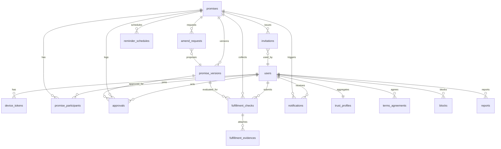

# 리틀핑거(Little Finger) 세부기능명세서 v1.1

> **이 문서의 용도**: AI 코딩 에이전트가 리틀핑거 MVP를 구현할 수 있도록, 기능별 화면 동작·필드·데이터 모델·엣지 케이스를 구현 단위까지 확정한 문서.
> **문서 우선순위**: `01_상위기획서` > **본 문서** > 디자인 산출물(와이어프레임). 충돌 시 상위 문서를 따른다.
> **이 문서에 없는 판단은 임의로 만들지 않는다.** §12 오픈 이슈로 반환하고 PO 컨펌을 받는다.

| 항목 | 내용 |
|---|---|
| 문서 버전 | v1.1 (2026-07-25) |
| 작성 목적 | F-01~F-12의 화면 동작, 필드 유효성, 데이터 모델, 상태 전이, 알림, 엣지 케이스 확정 |
| 독자 | AI 코딩 에이전트(주 독자), 대표(PO), 디자인 AI 에이전트 |
| 상위 문서 | `기획/01_상위기획서.md` (v1.2, 2026-07-25 확정) |
| 관련 문서 | `디자인/01_와이어프레임_디자인요청서.md` (v1.0) — 화면 ID·용어 라벨의 출처 |
| 후속 문서 | `기획/03_기술스택_비교분석.md` (N-3 결정 근거) → `기획/04_AI-Agent_코딩가이드.md` (확정 스택·저장소 구조·이식 규칙) |
| 범위 제외 | API 엔드포인트 상세 스펙, 기술 스택 선정, 배포 파이프라인 (→ 04 문서) |

**변경 이력**

| 버전 | 일자 | 내용 |
|---|---|---|
| v1.0 | 2026-07-25 | 최초 작성. 상위기획서 v1.1 + 디자인요청서 v1.0 기준. 신규 오픈 이슈 S-1~S-15 제기 |
| v1.1 | 2026-07-25 | **N-3 확정(React Native + Expo) 반영** — F-01 인증 구현 경로를 Supabase Auth 카카오 제공자로 확정(+카톡 인앱 `prompt=none` 자동 로그인), F-03 초대 공유를 OS 공유 시트로 확정, 푸시를 Expo Push Service(FCM 경유)로 명시, 후속 문서 번호 03→04 정정 |

---

## 1. AI 코딩 에이전트를 위한 지침

1. **서비스 원칙(P1~P6)은 어떤 구현 편의보다 우선한다.** 특히 P1(판정하지 않음), P2(양측 합의), P3(확정 후 불변), P4(신뢰 순간 광고 없음)은 코드 레벨에서 강제한다. 예: 단독으로 약속 내용을 수정하는 API는 존재해서는 안 된다.
2. **ID를 발명하지 않는다.** 기능은 F-01~F-12, 화면은 SCR-A00~A08 / MOD-01~03 / SCR-W01~W06, 상태는 §2-4의 11개 값, 엣지 케이스는 EC-*, 오픈 이슈는 S-*만 존재한다.
3. **상태 전이는 §7 전이표에 정의된 것만 허용한다.** 표에 없는 전이를 만드는 코드는 작성하지 않는다. 모든 전이는 서버에서만 수행하고, 클라이언트는 전이를 요청할 수만 있다.
4. **화면 표시 문구는 디자인요청서 §9 용어 사전을 따른다.** 코드 식별자는 영문(ACTIVE, penalty), 사용자 노출은 한국어 라벨(진행 중, 벌칙).
5. **"기본안"으로 표기된 값은 PO 미컨펌 상태다.** 그대로 구현하되, 상수·설정값으로 분리해 한 곳에서 바꿀 수 있게 한다(§11-3 설정값 목록).
6. **불변 데이터는 UPDATE/DELETE 하지 않는다.** `approvals`, `promise_versions`는 append-only다. `fulfillment_checks`는 §4-7-2의 1회 정정만 예외로 허용하며(`revised_at` 기록) 그 외 UPDATE·DELETE를 금지한다.
7. 구현 중 이 문서로 판단이 안 되는 지점이 생기면 임의 결정하지 말고 **작업 산출물 말미에 질문으로 반환**한다.

---

## 2. 공통 규칙

### 2-1. 표면(Surface)과 역할

| 표면 | 코드 | 대상 | 비고 |
|---|---|---|---|
| 안드로이드 앱 | `APP` | 작성자·주 사용자 | Google Play 배포. 광고 슬롯은 이 표면에만 |
| 수락용 웹 | `WEB` | 초대받은 상대방·증인 | 기기 무관, 카톡 인앱 브라우저 우선. **광고 전면 금지** |

| 역할 | 코드 | 정의 | 인원 |
|---|---|---|---|
| 작성자 | `CREATOR` | 약속을 만들고 초대를 보낸 사람 | 1명(고정) |
| 상대방 | `PARTNER` | 초대를 수락해 약속 당사자가 된 사람 | 1명(고정) |
| 증인 | `WITNESS` | 열람 + "확인 서명"만 가능한 제3자. **판정 권한 없음** | 최대 **2명**(확정) |

- **역할은 약속 단위로 부여된다.** 동일 사용자가 같은 약속에서 두 개 역할을 가질 수 없다(EC-B05, EC-D02).
- **"지킬 사람"(`keeper`)은 역할과 별개 속성**이다. `CREATOR` / `PARTNER` / `BOTH` 중 하나. 이행 확인 질문은 **양측 모두에게** 가고, 평가 대상은 지킬 사람의 이행 여부다.
- 계정은 표면과 무관하게 하나다. 웹에서 먼저 가입한 사용자가 앱을 설치해 같은 카카오 계정으로 로그인하면 **동일 `user_id`**이며 참여 중인 약속이 그대로 보인다(EC-A03).

### 2-2. 시각·날짜 규칙

| 항목 | 규칙 |
|---|---|
| 서버 저장 | 모든 타임스탬프는 UTC(`timestamptz`)로 저장 |
| 기준 타임존 | 표시·계산은 **Asia/Seoul(KST) 고정**. 사용자 기기 타임존을 따르지 않는다(EC-F09) |
| 종료일 | 날짜만(`date`, YYYY-MM-DD). 시각 개념 없음 |
| D-Day 계산 | `D = end_date - today(KST)`. 표시는 `D-7`, `D-1`, `D-Day`, 경과 시 `D+3` |
| 이행 확인 시작 | **종료일 익일 00:00 KST** (종료일 하루를 온전히 보장, EC-F08) |
| 이행 확인 기한 | CHECKING 진입 후 **7일**(기본안, §11-3 `CHECK_DEADLINE_DAYS`). 즉 `종료일 + 8일 00:00 KST`에 미응답 종결 |
| 스케줄 알림 발송 시각 | **09:00 KST** (기본안, S-9) |
| 조용한 시간 | 21:00~08:00 KST에는 스케줄 알림 미발송, 다음 08:00로 이연. **즉시성 알림은 예외**(§8-3) |
| 화면 표기 | 확정 시각·승인 로그는 `2026-07-25 14:32 (KST)` 형식으로 타임존 병기 |

### 2-3. 입력·검증·에러 표준

- **검증은 클라이언트와 서버 양쪽에서 수행하고, 서버 검증이 최종이다.** 클라이언트 검증만 통과한 값은 신뢰하지 않는다.
- 모든 텍스트 입력은 저장 전 앞뒤 공백 `trim`, 연속 개행 3줄 이상은 2줄로 축약, 제어문자 제거.
- 글자 수는 **유니코드 코드포인트 기준**(이모지 1자 처리).
- 주 CTA 버튼은 필수 필드가 모두 유효할 때까지 **비활성(disabled)** 상태를 유지하고, 비활성 이유를 필드 하단 인라인 메시지로 표시한다.

| 에러 코드 | HTTP | 상황 | 사용자 노출 문구 |
|---|---|---|---|
| `E_AUTH_REQUIRED` | 401 | 세션 없음·만료 | "다시 로그인해 주세요." |
| `E_FORBIDDEN` | 403 | 역할 권한 없음 | "이 약속에 대한 권한이 없어요." |
| `E_NOT_FOUND` | 404 | 약속·리소스 없음 | "약속을 찾을 수 없어요." |
| `E_INVITE_EXPIRED` | 410 | 초대 링크 만료 | "초대 링크가 만료됐어요. (72시간)" |
| `E_INVITE_USED` | 410 | 이미 사용된 링크 | "이미 사용된 초대 링크예요." |
| `E_INVITE_REVOKED` | 410 | 무효화된 링크 | "작성자가 초대를 다시 보냈어요. 최신 링크를 확인해 주세요." |
| `E_STATE_CONFLICT` | 409 | 현재 상태에서 불가능한 전이 | "약속 상태가 변경됐어요. 새로고침 후 다시 시도해 주세요." |
| `E_VALIDATION` | 422 | 필드 유효성 실패 | 필드별 메시지(§5) |
| `E_SELF_INVITE` | 422 | 본인 초대 수락 | "본인은 상대방이 될 수 없어요." |
| `E_DUPLICATE_ROLE` | 422 | 동일 약속 내 중복 역할 | "이미 이 약속에 참여하고 있어요." |
| `E_WITNESS_LIMIT` | 422 | 증인 상한 초과 | "증인은 최대 2명까지예요." |
| `E_BLOCKED` | 422 | 차단 관계 | "초대를 받을 수 없습니다." |
| `E_RATE_LIMIT` | 429 | 남용 방지 한도 초과 | "잠시 후 다시 시도해 주세요." |
| `E_UPLOAD_FAILED` | 400 | 이미지 업로드 실패 | "사진을 올리지 못했어요. 다시 시도해 주세요." |

### 2-4. 상태 값 (변경 금지)

`DRAFT` · `PENDING` · `ACTIVE` · `AMEND_PENDING` · `CHECKING` · `COMPLETED` · `BROKEN` · `DISPUTED` · `UNRESOLVED` · `DECLINED` · `CANCELED`

- 상위기획서 §6은 `DECLINED / CANCELED`를 한 행에 묶어 표기했으나, **DB·코드에서는 별개 값**이다(거절 / 파기).
- **완전 종결**(리마인드 없음, 이후 전이 없음): `COMPLETED`, `BROKEN`, `UNRESOLVED`, `DECLINED`, `CANCELED`.
- **준종결**: `DISPUTED` — 리마인드는 없고 목록상 '완료' 탭에 표시하지만, 재협의(T-16)로 `CHECKING`에 재진입할 수 있는 유일한 예외다.
  - `DISPUTED`를 준종결로 취급하는 것은 기본안이다(S-13). 상위기획서 v1.2 상태도가 `DISPUTED → CHECKING`으로 정정되어 본 문서의 T-16과 1:1로 일치한다. 종결은 재진입한 CHECKING 라운드에서 T-12/T-13으로 도달한다.
- 상태 라벨(화면 표시): 작성 중 / 승인 대기 / 진행 중 / 변경 협의 중 / 이행 확인 중 / 완료 / 불이행 / 의견 불일치 / 미확정 종결 / 거절됨 / 파기됨.
- 상위기획서 §6은 프로필 집계 라벨을 "무응답 종결 n건"으로 적었으나, 상태 라벨과 어긋나므로 본 문서는 **"미확정 종결 n건"으로 통일**한다(S-15).

---

## 3. 화면 인덱스 (화면 ↔ 기능 매핑)

| 화면 ID | 화면명 | 표면 | 주 기능 | 접근 역할 | 광고 |
|---|---|---|---|---|---|
| SCR-A00 | 온보딩 | APP | F-01 | 비로그인 | 금지 |
| SCR-A01 | 로그인 | APP | F-01 | 비로그인 | 금지 |
| SCR-A02 | 홈·약속 목록 | APP | F-10, F-12 | 전 역할 | **허용(1구좌, 비활성)** |
| SCR-A03 | 약속 작성 | APP | F-02 | CREATOR | 금지(P4) |
| SCR-A04 | 초대 전송·대기 | APP | F-03 | CREATOR | 금지(P4) |
| SCR-A05 | 약속 상세 | APP | F-04·F-05·F-07·F-08·F-11 | 전 역할 | 금지(P4) |
| SCR-A06 | 이행 확인 입력 | APP | F-07, F-08 | CREATOR/PARTNER | 금지(P4) |
| SCR-A07 | 알림함 | APP | F-06 | 전 역할 | 금지 |
| SCR-A08 | 마이·신뢰 프로필 | APP | F-09 | 본인 | 금지 |
| MOD-01 | 변경·파기 요청 모달 | APP | F-11 | CREATOR/PARTNER | 금지 |
| MOD-02 | 증인 초대 모달 | APP | F-05 | CREATOR/PARTNER | 금지 |
| MOD-03 | 완료 축하 | APP | F-07 | CREATOR/PARTNER | 금지 |
| SCR-W01 | 초대 랜딩 | WEB | F-03 | 비로그인 | **금지(웹 전면)** |
| SCR-W02 | 약속 검토 | WEB | F-03, F-04 | PARTNER(초대 대상) | 금지 |
| SCR-W03 | 승인 완료 | WEB | F-04, F-06 | PARTNER | 금지 |
| SCR-W04 | 참여 약속 열람·응답 | WEB | F-07·F-08·F-11 | PARTNER | 금지 |
| SCR-W05 | 증인 확인 | WEB | F-05 | WITNESS | 금지 |
| SCR-W06 | 링크 무효·만료 안내 | WEB | F-03 | 전체 | 금지 |

> 웹 표면에는 SCR-A08(프로필)에 해당하는 화면이 없다. 웹 참여자의 신뢰 프로필은 앱 설치 후 확인 가능하며, 이는 앱 설치 넛지의 근거로 사용한다(S-12).

---

## 4. 기능별 상세 명세

### F-01 가입·인증

| 항목 | 내용 |
|---|---|
| 관련 화면 | SCR-A00, SCR-A01 (APP) / SCR-W01 내 로그인 진입 (WEB) |
| 선행 조건 | 없음 |
| 완료 조건 | `users` 레코드 생성 또는 조회 + 세션 발급 + 약관 동의 기록 |

**4-1-1. 인증 방식 (확정)**

- **카카오 로그인 단독.** 다른 소셜 로그인·이메일 회원가입·전화번호 인증을 구현하지 않는다(전화번호 인증은 v2 강화 모드).
- **구현 경로(확정, 04 문서 §8)**: 카카오 로그인은 **Supabase Auth의 카카오 공식 OAuth 제공자**를 경유한다. 비공식 React Native 카카오 SDK는 쓰지 않는다.
- 앱: `signInWithOAuth({ provider: "kakao" })` + `expo-web-browser`의 인앱 브라우저 세션. 카카오톡 앱이 깔려 있으면 카카오가 앱으로 넘기고, **미설치 기기는 카카오 계정 웹 로그인으로 자동 폴백**된다(별도 분기 구현 불필요). 세션은 `expo-secure-store`에 보관.
- 웹: 같은 Supabase Auth 리다이렉트 방식. 카톡 인앱 브라우저에서의 동작이 **최우선 QA 항목**(§11-1, EC-A01).
- **카톡 인앱 자동 로그인(T-1 확정)**: 수락 웹 진입 시 `prompt=none`으로 먼저 시도해 이미 카카오에 로그인된 사용자는 버튼 탭 없이 통과시킨다. 실패하면 평소대로 SCR-W01의 로그인 버튼을 노출한다.
- **제약**: `account_email` 수집에는 카카오 **비즈 앱** 등록(사업자등록 필요)이 걸린다. 미등록 상태에서는 이메일을 받을 수 없으므로 이메일 없이 정상 진행해야 한다(04 문서 §13 C-1, EC-A02).
- 수집 동의 항목: `profile_nickname`(필수), `profile_image`(필수), `account_email`(**선택**). 이메일 미동의도 정상 진행하며, 웹 참여자에게는 SCR-W03에서 리마인드 수신용 이메일을 직접 입력받는다(EC-A02).

**4-1-2. 화면 동작**

| 화면 | 동작 |
|---|---|
| SCR-A00 온보딩 | 최초 실행 1회만. 3장 이내 슬라이드(핵심 루프 요약) + [건너뛰기]. 완료 여부는 로컬 저장. → SCR-A01 |
| SCR-A01 로그인 | [카카오로 시작하기] 단일 버튼. 하단에 이용약관·개인정보처리방침 링크와 "가입 시 약관에 동의한 것으로 봅니다" 고지. 로그인 성공 → 신규는 약관 동의 기록 후 SCR-A02, 기존은 SCR-A02(딥링크 진입 시 해당 화면) |
| SCR-W01 로그인 진입 | [카카오 로그인하고 내용 보기]. 로그인 성공 후 **원래 초대 토큰이 가리키던 SCR-W02로 복귀**해야 한다. 토큰은 OAuth `state` 파라미터에 담아 유지(EC-A01) |

**4-1-3. 서버 처리 규칙**

1. 카카오에서 받은 `kakao_id`로 `users` 조회 → 없으면 생성(`status=ACTIVE`, `primary_surface`= 로그인 표면).
2. 기존 사용자면 `nickname`·`profile_image_url`을 최신값으로 갱신한다(카카오에서 변경 가능).
3. 세션: **Supabase Auth가 발급하는 JWT**를 쓰고 자체 발급하지 않는다. 앱은 `expo-secure-store`, 웹은 Supabase JS 클라이언트 기본 저장소(자동 갱신 켬). 만료·갱신 주기는 Supabase 프로젝트 설정에서 관리한다.
4. 신규 사용자는 `terms_agreements`에 약관 버전과 동의 시각을 기록한다(Google Play·개인정보 요건).
5. 앱 로그인 시 **Expo 푸시 토큰**(`expo-notifications`로 발급, 내부적으로 FCM 경유)을 `device_tokens`에 등록·갱신한다. 기기당 1행, 사용자당 최대 3기기 보관(초과 시 가장 오래된 것 삭제, EC-H04).

**4-1-4. 탈퇴**

- 진입: SCR-A08 하단. 진행 중 약속(`PENDING`/`ACTIVE`/`AMEND_PENDING`/`CHECKING`)이 있으면 **건수를 보여주고 경고**한 뒤 2단계 확인.
- 처리 규칙(기본안, S-14): §6-5 참조. 개인정보는 비식별화하되 **상대방의 기록 열람권은 보존**한다(상위기획서 §10).
- 확정된 약속 기록의 삭제는 불가하다. 요청 시 "확정된 약속 기록은 상대방의 기록이기도 해서 삭제할 수 없어요. 개인정보는 비식별 처리됩니다."로 안내한다(EC-H03).

**관련 엣지 케이스**: EC-A01 ~ EC-A07

---

### F-02 약속 작성 (앱)

| 항목 | 내용 |
|---|---|
| 관련 화면 | SCR-A03 (APP 전용) |
| 선행 조건 | 로그인, `users.status = ACTIVE` |
| 결과 상태 | `DRAFT` (저장 시) → `PENDING` (초대 발송 시, F-03) |
| 필드 명세 | §5-1 |

**4-2-1. 화면 동작**

- 진입: SCR-A02의 FAB [약속 만들기], 또는 빈 상태 CTA, 또는 MOD-03의 [새 약속 만들기].
- 입력 필드는 §5-1의 7개 항목 전체를 한 화면에 세로 배치한다(단계 분할 마법사 아님 — 작성자는 앱 사용자이므로 이탈 위험이 낮고, 전체를 한눈에 보는 편이 약속 내용 검토에 유리).
- **자동 임시저장**: 입력 변경 후 3초 debounce로 로컬에 초안 저장. 화면 이탈 시 "임시저장했어요" 스낵바. 서버 `DRAFT` 레코드는 **[저장] 또는 [상대에게 보내기]를 누른 시점에만** 생성한다(빈 DRAFT 양산 방지).
- **보상/벌칙 프리셋**: §5-5 목록을 칩(chip) 형태로 노출. 칩 선택 시 텍스트 필드에 문구가 채워지고 이후 자유 편집 가능. 프리셋은 힌트일 뿐 값 자체는 자유 텍스트로 저장한다.
- **증인 사용 여부** 토글을 켜면 "확정 후 증인을 초대할 수 있어요(최대 2명)" 안내를 표시한다. 실제 초대는 MOD-02에서 수행하며, 작성 화면에서 증인을 지정하지 않는다.
- **카테고리 `MONEY`(금전) 선택 시**: 필드 하단에 추가 안내를 고정 노출한다 — "금전 약속도 기록할 수 있지만, 리틀핑거는 차용증·공증 서비스가 아니에요." (상위기획서 §14 법적 오인 리스크 대응)
- 주 CTA [상대에게 보내기] → 유효성 통과 시 `DRAFT` 생성 + 즉시 F-03 초대 발송 처리 → SCR-A04로 이동.
- 보조 액션 [임시저장]은 `DRAFT`로 저장하고 SCR-A02로 복귀한다.

**4-2-2. 서버 처리 규칙**

1. `promises` 1행 + `promise_versions` 1행(`version_no = 1`)을 함께 생성한다. 내용성 필드의 **원본은 항상 `promise_versions`**이고, `promises`의 동일 컬럼은 조회·배치용 캐시다.
2. `content_hash`는 이 시점에 계산해 저장하되, **법적 의미를 갖는 확정 해시는 ACTIVE 전환 시의 값**이다(F-04).
3. `promise_participants`에 `CREATOR` 1행(`status=JOINED`)을 생성한다.
4. `DRAFT` 수정은 작성자만 가능하며, 수정 시 `version_no`를 올리지 않고 **버전 1행을 덮어쓴다**(확정 전이므로 P3 대상이 아님).
5. `DRAFT` 삭제는 작성자 단독으로 가능하다(하드 삭제).
6. 남용 방지: 사용자당 `DRAFT` 최대 20건, 일일 신규 약속 생성 30건(기본안). 초과 시 `E_RATE_LIMIT`.

**관련 엣지 케이스**: EC-C03, EC-H05, EC-I04

---

### F-03 초대·상호 승인

| 항목 | 내용 |
|---|---|
| 관련 화면 | SCR-A04 (APP) / SCR-W01 → SCR-W02 → SCR-W03, SCR-W06 (WEB) |
| 선행 조건 | `DRAFT` 상태 + 필수 필드 유효 |
| 결과 상태 | `PENDING` → `ACTIVE` / `DECLINED` / `DRAFT`(수정 제안) |

**4-3-1. 초대 링크 정책 (확정)**

| 항목 | 값 |
|---|---|
| 유효 기간 | **72시간** (`invitations.expires_at`) |
| 사용 횟수 | **1회용** (수락·거절·수정 제안 중 하나가 완료되면 `USED`) |
| 토큰 | 32바이트 CSPRNG → URL-safe Base64. **DB에는 해시(SHA-256)만 저장**하고 원본은 링크에만 존재 |
| URL 형식 | `https://{web-domain}/i/{token}` |
| 대상 구분 | `invitations.target_role` = `PARTNER` \| `WITNESS`. 역할이 다른 링크로 접근하면 안내 후 차단(EC-D05) |
| 재발송 | 만료·무효화 후 가능. 새 토큰 발급 + **기존 토큰 즉시 `REVOKED`**. 1약속당 재발송 10회 제한(기본안) |
| 앱 딥링크 | Android App Links로 동일 URL 처리. 앱 설치 기기는 앱에서 열고, 미설치는 웹으로(EC-I01) |

**4-3-2. SCR-A04 초대 전송·대기 (작성자)**

- [카카오톡으로 초대 보내기] → **OS 기본 공유 시트**(`expo-sharing` / RN `Share`)로 초대 링크를 보낸다(확정, 04 문서 §8). 카카오 공유 SDK의 메시지 템플릿은 MVP에서 쓰지 않는다(04 문서 §13 C-4). 공유 문구에는 **약속 제목과 링크만** 담고 내용 전문은 넣지 않는다(카톡 대화방 노출 최소화).
- 만료까지 남은 시간을 카운트다운으로 표시한다(`72:00:00` → 실시간 감소, 분 단위 갱신).
- [링크 다시 공유]: 만료 전에도 같은 링크를 다시 공유할 수 있다(토큰 재발급 없음).
- **[초대 링크 무효화]** (기본안, S-11): 잘못된 사람에게 보낸 경우를 위해 현재 토큰만 `REVOKED` 처리한다. 약속 상태는 `PENDING`을 유지하고 [초대 다시 보내기]로 새 토큰을 발급한다. **약속 자체를 철회(취소)하는 버튼은 없다**(디자인 O-D1 기본안 유지).
- 만료 시: 카운트다운 영역이 "초대가 만료됐어요"로 바뀌고 [초대 다시 보내기]가 활성화된다. 약속 상태는 `PENDING` 유지.

**4-3-3. SCR-W01 초대 랜딩 (비로그인)**

- 토큰으로 조회 가능한 **최소 정보만** 노출: 작성자 닉네임, 약속 제목, 만료 카운트다운, 서비스 한 줄 소개. **약속 본문·보상·벌칙은 로그인 전에 노출하지 않는다**(링크 유출 대비).
- 토큰이 만료/사용됨/무효화/존재하지 않음 → 즉시 SCR-W06(사유별 문구, §2-3 에러 코드 매핑).
- [카카오 로그인하고 내용 보기] → OAuth. `state`에 토큰을 담아 로그인 후 SCR-W02로 복귀.

**4-3-4. SCR-W02 약속 검토 (핵심 전환 화면)**

표시 요소: 약속 전문, 종료일 + D-Day, 보상/벌칙, 지킬 사람, 작성자 프로필, **디스클레이머(문구 고정)**, 증인 사용 예정 여부.

3택 액션:

| 액션 | 처리 | 결과 |
|---|---|---|
| **승인하기** (주 CTA) | 오수락 방지 확인 → 승인 | `ACTIVE` → SCR-W03 |
| 수정 제안 | 의견 입력(필수, 5~300자) | `DRAFT` 회귀 + 작성자 알림 |
| 거절 | 사유 입력(**선택**, 0~200자, 디자인 O-D2 기본안) | `DECLINED` + 작성자 알림 |

- **오수락 방지 절차**(상위기획서 F-03 요구사항): 승인 버튼을 누르면 확인 시트를 띄운다 — "**{작성자 닉네임}**님이 보낸 약속이 맞나요? 승인하면 두 사람의 기록으로 확정돼요." → [네, 승인합니다] / [아니에요]. 승인 완료 시 작성자에게 **상대방 닉네임·프로필 이미지를 포함한 알림**을 발송해 작성자가 즉시 검증할 수 있게 한다. 잘못된 상대가 수락한 경우는 신고 경로로 처리하며, 시스템 자동 무효화는 MVP 범위에서 제외한다(EC-B04, S-3).
- **종료일 경과 검증**: 72시간 대기 중 종료일이 지나버린 경우, 승인 버튼을 비활성화하고 "종료일이 지난 약속은 승인할 수 없어요. 작성자에게 종료일 변경을 요청해 주세요." + [종료일 변경 요청하기](= 수정 제안 처리)를 노출한다(EC-B10).
- 웹은 **가입 폼 없음**. 로그인 → 검토 → 승인까지 스크롤 최소화, 화면당 주 CTA 1개(3분 완주 목표).

**4-3-5. 서버 처리 규칙 — 승인(ACTIVE 전환)**

단일 트랜잭션에서 아래를 모두 수행하며, 하나라도 실패하면 전체 롤백한다(부분 확정 금지, EC-C02).

1. 토큰 검증: 존재·미사용·미만료·미무효화. 실패 시 해당 에러 코드.
2. 수락자 검증: `user_id ≠ creator_id`(`E_SELF_INVITE`), 동일 약속 내 기존 역할 없음(`E_DUPLICATE_ROLE`), 차단 관계 없음(`E_BLOCKED`), 종료일 미경과.
3. 상태 조건부 갱신: `UPDATE promises SET status='ACTIVE' WHERE id=? AND status='PENDING'` — 0행이면 `E_STATE_CONFLICT`(동시 요청 멱등 처리, EC-C01).
4. `promise_participants`에 `PARTNER` 추가(`status=JOINED`, `user_id` 확정).
5. `approvals`에 **2행**을 남긴다 — 작성자의 승인(발송 시점 기록을 승인으로 간주, §4-3-6)과 상대방의 승인(현재 시각). 각 행에 `content_hash`, `surface`, `ip_hash`, `user_agent_hash`를 기록한다.
6. `promises.activated_at` = 현재 시각. 해당 버전의 `activated_at`·`content_hash` 확정(F-04).
7. `invitations.status = USED`, `used_by`, `used_at` 기록.
8. 리마인드 스케줄 생성: 양측 각각 D-7/D-3/D-1/D-Day(과거 시점은 생성하지 않음, §8-2).
9. 작성자에게 확정 알림 발송(상대 프로필 포함).
10. `daily_metrics.activated_count` 증가(광고 임계값 판단 근거, F-12).

**4-3-6. 작성자의 승인 시점 정의 (중요)**

"양측 승인"은 **작성자의 초대 발송 = 작성자의 승인 의사 표시**, **상대방의 승인 클릭 = 상대의 승인 의사 표시**로 구성된다. 작성자가 확정 시점에 별도로 한 번 더 승인하는 절차는 없다(불필요한 왕복 제거). 단 `approvals` 로그에는 작성자의 승인 시각을 **초대 발송 시각**으로 기록하고, 화면에는 "작성자 승인 2026-07-25 14:20 / 상대방 승인 2026-07-26 09:11" 형태로 두 시각을 모두 표시한다.

**관련 엣지 케이스**: EC-B01 ~ EC-B11, EC-C01 ~ EC-C04

---

### F-04 확정 기록

| 항목 | 내용 |
|---|---|
| 관련 화면 | SCR-A05(ACTIVE 이후 전 상태), SCR-W03, SCR-W04 |
| 트리거 | `PENDING → ACTIVE` 전환(F-03) |

**4-4-1. 확정 시 저장 항목**

| 항목 | 컬럼 | 설명 |
|---|---|---|
| 확정 시각 | `promises.activated_at` | 양측 승인이 완료된 서버 시각(UTC 저장, KST 표시) |
| 양측 승인 로그 | `approvals` 2행 | 행위자·역할·행위·시각·표면·IP 해시·UA 해시 |
| 내용 해시 | `promise_versions.content_hash` | 위·변조 검증용. 계산 규칙은 아래 |

**4-4-2. `content_hash` 계산 규칙 (구현 필수 준수)**

```
1. 대상 필드를 아래 순서로 고정한 JSON 객체를 만든다(키 순서 고정, 공백 없음):
   { "title", "body", "category", "end_date", "keeper", "reward", "penalty", "version_no" }
2. 문자열 값은 trim 후 Unicode NFC 정규화. null은 빈 문자열("")로 치환.
3. end_date는 "YYYY-MM-DD" 문자열.
4. UTF-8 인코딩 → SHA-256 → 소문자 hex 64자.
5. 저장: promise_versions.content_hash
```

- 확정 이후 서버가 버전 내용을 읽을 때 해시를 재계산해 비교하는 **검증 잡을 주기적으로 실행**하고, 불일치 시 상세 화면에 "기록 검증 실패" 배지 + 운영 알림을 남긴다(기본안, EC-H06).

**4-4-3. 확정 스탬프 영역 (SCR-A05 / SCR-W03 공통)**

표시: "확정된 약속" 라벨 + 확정 시각(KST) + 양측 승인 로그(닉네임·역할·시각) + 증인 서명 현황 + [버전 이력 보기] + **디스클레이머**.

디스클레이머 문구(상위기획서 §10 확정 문구, **변경 금지**):

> 리틀핑거의 약속 기록은 공증이나 전자계약 서비스가 아니며, 법적 효력을 보증하지 않습니다. 다만 양측의 승인 이력과 시각 정보는 분쟁 시 참고 자료로 활용될 수 있습니다.

노출 위치(고정): SCR-W02 검토 화면, SCR-W03 승인 완료, SCR-A05 확정 영역, SCR-A08 약관 화면. 접기(collapse) 처리하지 않는다.

**4-4-4. SCR-W03 승인 완료 (웹 참여자 온보딩 지점)**

1. 확정 스탬프 + 디스클레이머.
2. **이메일 등록(선택)**: "리마인드를 이메일로 받을까요?" — 카카오 이메일 동의가 있으면 프리필, 없으면 직접 입력. 미등록 시 "알림을 받지 못할 수 있어요"를 명시한다(EC-G01).
3. **재접근 안내**: "이 약속은 카카오 로그인으로 언제든 다시 볼 수 있어요" + 북마크 안내. 초대 토큰이 소진되어도 **계정 기반으로 SCR-W04에 접근 가능**하다는 점이 핵심이다.
4. 앱 설치 유도 배너: "다음엔 직접 약속을 만들어보세요" + Play 스토어 링크(설치 전환 KPI 측정용 UTM/Referrer 부착).

**관련 엣지 케이스**: EC-C03, EC-H06

---

### F-05 증인 초대 (최대 2명)

| 항목 | 내용 |
|---|---|
| 관련 화면 | MOD-02 (APP) / SCR-W05 (WEB) |
| 선행 조건 | `witness_enabled = true`이거나 상세에서 증인 초대를 시작. 약속 상태 `PENDING`·`ACTIVE`·`AMEND_PENDING`·`CHECKING` |
| 상한 | **2명(확정)**. `JOINED` + 유효한 `INVITED` 합계로 계산 |

**4-5-1. 권한 (P1 준수)**

증인은 **① 약속 전문 열람 ② "내용을 확인했습니다" 확인 서명**만 가능하다. 승인·거절·수정 제안·변경·파기·이행 확인 응답은 **모두 불가**하며, 서버에서 역할 검사로 차단한다. 증인의 서명 여부는 상태 전이에 **어떠한 영향도 주지 않는다**(서명이 없어도 약속은 정상 진행).

**4-5-2. 화면 동작**

| 화면 | 동작 |
|---|---|
| MOD-02 증인 초대 모달 | 남은 슬롯 표시("증인 1/2"), [카카오톡으로 증인 초대하기], 초대 중·참여 중 증인 목록(닉네임 + 상태: 초대 중/확인 완료). 상한 도달 시 버튼 비활성 + "증인은 최대 2명까지예요" |
| SCR-W05 증인 확인 | 약속 전문 **읽기 전용**, 참여자 정보, 확정 시각, 권한 안내("증인은 내용을 확인하는 역할이에요. 약속이 지켜졌는지 판정하지는 않아요."), [확인 서명]. 서명 후 재방문 시 서명 시각 표시 |

- 증인 초대는 작성자와 상대방 **둘 다** 발송할 수 있다(약속은 양측의 것이므로). 상한은 약속 단위로 공유한다.
- 증인 초대 링크도 1회용·72시간 규칙을 동일하게 적용한다.
- 증인이 확인 서명하면 `approvals`에 `WITNESS_SIGN` 행을 남기고 양측 당사자에게 알림을 보낸다.
- `COMPLETED`/`BROKEN`/`UNRESOLVED`/`DECLINED`/`CANCELED` 이후에는 신규 증인 초대가 불가하다(기존 증인의 열람은 계속 가능).

**관련 엣지 케이스**: EC-D01 ~ EC-D05

---

### F-06 리마인드·알림

| 항목 | 내용 |
|---|---|
| 관련 화면 | SCR-A07 알림함, SCR-A08 리마인드 설정, SCR-A05 상단 배지 |
| 채널 | APP: FCM 푸시 + 인앱 알림함 / WEB: 이메일(등록 시) + 로그인 후 화면 내 표시 |
| 전체 매트릭스 | §8 |

**4-6-1. 기본 리마인드 스케줄 (확정)**

- 종료일 기준 **D-7 / D-3 / D-1 / D-Day**, 발송 시각 09:00 KST(기본안, S-9).
- 확정 시점에 이미 지난 시점의 리마인드는 생성하지 않는다(예: 종료일이 5일 뒤면 D-7은 생성 안 함).
- 종료일이 변경되면(F-11 변경 합의) 미발송 스케줄을 전부 취소하고 재생성한다.
- 사용자별 설정(SCR-A08): D-7/D-3/D-1/D-Day 개별 on/off, 발송 시각 변경(09:00/12:00/20:00 중 선택, 기본안).
- **끌 수 없는 알림**(설정과 무관하게 발송): 확정 완료, 거절·수정 제안, 이행 확인 요청, 결과 확정, 변경·파기 요청과 그 응답. 설정 화면에 "중요 알림은 항상 받아요"로 고지한다(EC-G05).

**4-6-2. 웹 참여자 알림 도달 보완 (핵심 리스크 대응)**

웹 참여자는 푸시를 받을 수 없다. 상위기획서 §14의 "웹 참여자 알림 도달" 리스크에 대해 아래를 구현한다.

1. 이메일 등록을 SCR-W03에서 1회 유도하고, 미등록 상태로 CHECKING에 진입하면 SCR-W04 방문 시 다시 유도한다(총 2회, S-6).
2. **작성자 화면에 대리 알림 버튼**: 상대가 이메일 미등록이고 앱 미설치인 경우, SCR-A05에 "상대에게 카톡으로 알리기" 버튼을 노출해 작성자가 카카오 공유로 직접 알릴 수 있게 한다(EC-G01).
3. 이메일 발송 실패(bounce)는 `email_verified=false`로 되돌리고 재등록을 유도한다(EC-G03).

**4-6-3. 알림함(SCR-A07) 동작**

- 최신순 목록. 유형 아이콘 + 제목 + 본문 1줄 + 상대 시각("3시간 전"). 읽지 않은 항목 강조.
- 항목 탭 → `deeplink`로 해당 약속 상세(SCR-A05) 또는 이행 확인(SCR-A06) 이동. 읽음 처리.
- [모두 읽음] 액션. 보관 기간 90일(기본안).
- **중복 제거**: 동일 `dedupe_key`(약속 ID + 알림 유형 + 날짜)는 1일 1회만 생성한다(EC-G04).

**관련 엣지 케이스**: EC-G01 ~ EC-G05

---

### F-07 이행 확인

| 항목 | 내용 |
|---|---|
| 관련 화면 | SCR-A06(입력), SCR-A05(현황), MOD-03(축하) / SCR-W04(웹 입력) |
| 트리거 | 종료일 익일 00:00 KST 배치(J-02) → `ACTIVE → CHECKING` |
| 응답 기한 | CHECKING 진입 후 **7일**(기본안, §11-3 `CHECK_DEADLINE_DAYS`) |
| 필드 명세 | §5-2 |

**4-7-1. 응답 대상과 질문**

- 질문: "**약속이 지켜졌나요?**" → [예] / [아니오] 2택 + 한 줄 의견(선택) + 증빙 이미지(선택, F-08).
- **양측(작성자·상대방) 모두에게 질문한다.** `keeper`가 한쪽이어도 양측이 응답한다(평가 대상은 지킬 사람의 이행 여부, EC-F04).
- 증인은 응답 대상이 아니다(P1).

**4-7-2. 판정 규칙 (앱은 판정하지 않는다 — P1)**

| 양측 응답 | 결과 상태 |
|---|---|
| 예 + 예 | `COMPLETED` |
| 아니오 + 아니오 | `BROKEN` |
| 예 + 아니오 (불일치) | `DISPUTED` |
| 한쪽 이상 무응답 + 기한 경과 | `UNRESOLVED` |

- 상태 전이는 **두 번째 응답이 저장되는 트랜잭션에서** 수행한다(동시 제출 시 트랜잭션 직렬화, EC-F01).
- 첫 응답자에게는 "상대의 응답을 기다리는 중" 상태를 표시하고, 상대에게 알림을 발송한다.
- **응답 수정**: 상대가 아직 응답하지 않았고 상태 전이 전인 경우에만 **1회 수정 가능**(기본안). 전이 후에는 수정 불가하며 DISPUTED 재협의로만 다툰다(EC-F02).

**4-7-3. DISPUTED 처리 (P1 절대 준수)**

- 상세 화면에 양측 주장을 **좌우/상하 대등하게** 배치한다. 응답 시각, 한 줄 의견, 증빙을 각각 표시한다.
- 증인의 확인 서명 여부는 "참고 정보"로만 표시하고, **증인의 의견을 판정 근거로 쓰지 않는다.**
- 앱은 어느 쪽이 옳은지 **표시·추천·암시하지 않는다.** 정렬 순서로도 우열을 만들지 않는다(작성자 먼저 고정 배치, 강조 스타일 동일).
- 중립 안내 문구: "두 분의 확인이 서로 달라요. 대화로 다시 정해보세요." + [다시 확인 요청하기].
- **재협의**: [다시 확인 요청하기] → `round_no + 1`로 새 이행 확인 라운드를 시작한다. 양측 재응답이 일치하면 `COMPLETED`/`BROKEN`으로 전이, 불일치·무응답이면 `DISPUTED` 유지. 라운드 기한 7일, 횟수 무제한(기본안, S-10). 모든 라운드 기록을 보존해 상세에서 히스토리로 볼 수 있게 한다.

**4-7-4. UNRESOLVED 처리**

- 기한 경과 시 배치(J-03)로 전이. 약속 지킴율 계산에서 제외하고(S-8) 프로필에 "미확정 종결 n건"으로 별도 표기한다(S-15).
- 상세 화면에는 **사실만** 기록한다: "작성자 응답 완료 / 상대방 미응답". 누구의 잘못인지는 표시하지 않는다(P1).

**4-7-5. MOD-03 완료 축하**

- `COMPLETED` 전이 직후 해당 사용자가 앱에서 처음 확인할 때 1회 노출.
- 내용: 축하 메시지, 약속 지킴율 변화("87% → 89%"), [새 약속 만들기], [공유하기](이미지 카드 생성은 v1.1 이연 — MVP는 텍스트 공유).

**관련 엣지 케이스**: EC-F01 ~ EC-F10

---

### F-08 이행 증빙 첨부

| 항목 | 내용 |
|---|---|
| 관련 화면 | SCR-A06, SCR-W04 (첨부) / SCR-A05, SCR-W04, SCR-W05 (열람) |
| 필드 명세 | §5-2 |

| 항목 | 규칙(기본안, §11-3 `EVIDENCE_MAX_COUNT`/`EVIDENCE_MAX_MB`) |
|---|---|
| 개수 | 이행 확인 1건당 최대 **3장** |
| 용량 | 원본 1장당 **10MB** 이하 |
| 형식 | JPEG / PNG / WEBP / HEIC(서버에서 JPEG 변환) |
| 처리 | 서버에서 장변 최대 1920px 리사이즈 + EXIF **위치정보 제거**(개인정보 보호), 썸네일 320px 생성 |
| 공개 범위 | 해당 약속의 당사자 2명 + 증인(최대 2명). **그 외 접근 불가** |
| 저장 | 비공개 버킷 + 만료형 서명 URL(유효 10분, 기본안) |
| 보관 기간 | 약속 종결 후 **1년** 후 삭제(기본안, §11-3 `EVIDENCE_RETENTION_DAYS`). 삭제 후에는 "만료된 증빙" 플레이스홀더 표시 |

- 업로드는 개별 병렬 처리하며, 일부 실패해도 성공한 것만 유지하고 텍스트 응답만으로 제출할 수 있다(EC-F05).
- 부적절한 이미지는 신고 대상이며, 운영자가 블라인드 처리하면 열람 시 "신고 접수로 가려진 이미지입니다"로 표시한다(EC-F06).

---

### F-09 신뢰 프로필

| 항목 | 내용 |
|---|---|
| 관련 화면 | SCR-A08 (APP 전용) |
| 표시명 | **약속 지킴율** (디자인 O-D3 기본안) |

**4-9-1. 계산 규칙**

```
모수 대상: 내가 CREATOR 또는 PARTNER로 참여하고,
          keeper에 내가 포함된(CREATOR/PARTNER/BOTH) 약속  ← 기본안 S-1

분자 = 위 조건 + status = COMPLETED 인 약속 수
분모 = 위 조건 + status IN (COMPLETED, BROKEN) 인 약속 수
약속 지킴율 = round(분자 / 분모 × 100)   // 소수점 없음

분모 < 3 이면 % 대신 "집계 중"으로 표시한다(기본안 S-2)
```

- **계산에서 제외**: `DRAFT`, `PENDING`, `ACTIVE`, `AMEND_PENDING`, `CHECKING`, `DISPUTED`, `UNRESOLVED`, `DECLINED`, `CANCELED`.
- **별도 건수 표기**(약속 지킴율 왜곡 방지, 상위기획서 F-09): "의견 불일치 n건", "미확정 종결 n건".
- `keeper = BOTH`인 약속이 `BROKEN`이면 양측 모두의 분모에 반영된다. 앱은 누가 어겼는지 판정하지 않으므로 **약속 단위로 동일하게 집계**한다(P1).
- 갱신: 종결 상태 전이 트랜잭션에서 `trust_profiles` 집계 행을 갱신한다(실시간). 정합성 보정을 위해 일 1회 전량 재계산 배치를 둔다.

**4-9-2. 화면 표시 (SCR-A08)**

약속 지킴율(%) 또는 "집계 중" / 완료 n건 / 불이행 n건 / 의견 불일치 n건 / 미확정 종결 n건 / 진행 중 n건 / 리마인드 설정 / 약관·개인정보처리방침·디스클레이머 / 차단 목록 관리 / 로그아웃 / 탈퇴.

- **상대방의 지킴율 노출 여부**: MVP에서는 **노출하지 않는다**(기본안, S-12). 초대 단계에서 상대 신뢰도를 평가하게 만들면 관계 친화적 톤(핵심 가치 3)을 훼손할 수 있다. 본인 프로필만 표시한다.
- 뱃지·랭킹 등 게임화는 v1.1 이연.

---

### F-10 홈·약속 목록 (앱)

| 항목 | 내용 |
|---|---|
| 관련 화면 | SCR-A02 |
| 탭 구조 | **진행 중 / 대기 / 완료** 3탭(디자인 O-D4 기본안) |

**4-10-1. 탭별 포함 상태**

| 탭 | 포함 상태 | 정렬 |
|---|---|---|
| 진행 중 | `ACTIVE`, `AMEND_PENDING`, `CHECKING` | ① `CHECKING` 우선 ② D-Day 오름차순 |
| 대기 | `DRAFT`, `PENDING` | 최근 수정순 |
| 완료 | `COMPLETED`, `BROKEN`, `DISPUTED`, `UNRESOLVED`, `DECLINED`, `CANCELED` | 종결 시각 최신순 |

**4-10-2. 화면 동작**

- **임박 고정 영역**: 최상단에 `CHECKING` 상태 또는 D-3 이내 `ACTIVE` 약속을 카드로 고정한다. `CHECKING` 카드의 CTA는 [이행 확인하기](→ SCR-A06). 없으면 영역 자체를 숨긴다.
- **카드 구성**: 상태 라벨(§2-4) + 제목 + 상대방 닉네임·프로필 + D-Day 배지 + 증인 아이콘(있을 때) + 내 응답 필요 여부 표시.
- **빈 상태**: "아직 약속이 없어요. 첫 약속을 만들어보세요" + 일러스트 자리 + [약속 만들기].
- **페이징**: 20건 단위 무한 스크롤. Pull-to-refresh 지원.
- **광고 슬롯**: 목록 하단 1구좌(F-12). 비활성 시 렌더하지 않는다(빈 공간 남기지 않음).
- FAB [약속 만들기] → SCR-A03.
- 증인으로만 참여한 약속: 별도 탭을 만들지 않고 각 탭에 **"증인" 배지**를 붙여 함께 노출한다(기본안).

---

### F-11 변경·파기 합의

| 항목 | 내용 |
|---|---|
| 관련 화면 | MOD-01(요청), SCR-A05(비교 뷰·응답) / SCR-W04(웹 응답) |
| 선행 조건 | 약속 상태 = `ACTIVE` **한정** |
| 결과 상태 | `AMEND_PENDING` → `ACTIVE`(변경 승인/거절/철회/기한만료) 또는 `CANCELED`(파기 승인) |

**4-11-1. 요청 규칙**

- 요청 가능 주체: 작성자 **또는** 상대방(양측 대등). 증인 불가.
- 요청 유형: `AMEND`(내용 변경) / `CANCEL`(파기).
- **동시에 1건만** 진행할 수 있다. 이미 `AMEND_PENDING`이면 새 요청은 `E_STATE_CONFLICT`(EC-E01).
- **`CHECKING` 상태에서는 변경·파기 요청이 불가하다**(상태 전이표에 해당 전이 없음). "이행 확인이 진행 중이에요. 확인이 끝난 뒤에 변경할 수 있어요."로 안내한다(EC-E05).
- 응답 기한: **7일**(기본안, §11-3 `AMEND_AUTO_WITHDRAW_DAYS`). 무응답 시 자동 철회 후 `ACTIVE` 복귀 + 양측 알림(교착 방지, EC-E04).

**4-11-2. MOD-01 요청 모달**

| 유형 | 입력 |
|---|---|
| 내용 변경 | 변경할 필드(제목·내용·종료일·보상·벌칙·지킬 사람)를 현재 값 프리필 상태로 편집. 변경 이유(선택, 0~200자) |
| 파기 | 파기 이유(선택, 0~200자) + "두 사람 모두 동의하면 약속이 파기돼요" 안내 |

- 공통 안내: "상대가 승인하면 적용돼요. 승인 전까지는 지금 약속이 그대로 유지돼요."
- 변경 요청 시 **종료일 검증**: 새 종료일은 **요청 시점 기준 오늘 이후**여야 한다. 승인 시점에 다시 검증하며, 그 사이 지나버렸으면 승인을 차단하고 재요청을 안내한다(EC-E03).

**4-11-3. 응답과 비교 뷰**

- `AMEND_PENDING` 상태의 SCR-A05 / SCR-W04는 **변경 전/후 비교 뷰**를 표시한다. 변경된 필드만 강조(이전 값 취소선 + 새 값), 변경 이유, 요청자·요청 시각.
- 응답자 액션: [변경 승인] / [거절]. 요청자 액션: [요청 철회].
- 승인 시: `promise_versions`에 `version_no + 1` 행을 생성하고 새 `content_hash`를 계산해 활성화한다. **이전 버전은 보존**하며(P3), 종료일이 바뀌면 리마인드를 재생성한다.
- 파기 승인 시: `CANCELED`로 전이, 미발송 리마인드 전부 취소, 이행 확인 없음, 약속 지킴율 제외.

**4-11-4. 버전 이력 화면**

- 진입: SCR-A05 확정 스탬프 영역의 [버전 이력 보기].
- 표시: 버전 번호·활성 기간·변경 요청자·승인자·승인 시각·`content_hash` 앞 8자·변경 이유. 각 버전의 전문 열람 가능.
- 이력은 **읽기 전용, 삭제 불가**.

**관련 엣지 케이스**: EC-E01 ~ EC-E05

---

### F-12 광고 슬롯 (앱)

| 항목 | 내용 |
|---|---|
| 관련 화면 | SCR-A02 하단 **1구좌만** |
| 형식 | 네이티브 광고(AdMob 계열) |
| 활성화 조건 | **일 확정(ACTIVE 전환) 약속 100건 도달**(확정) |
| 제어 | 서버 원격 플래그 `ads_enabled`(기본값 `false`). 앱 업데이트 없이 켤 수 있어야 한다 |

**금지 구역(P4, 코드 레벨 강제)**: SCR-A03 작성, SCR-A04 초대, SCR-A05 상세, SCR-A06 이행 확인, MOD-01~03, **수락용 웹 전체(SCR-W01~W06)**. 광고 SDK는 앱 모듈에만 포함하고 **웹 프로젝트에는 광고 라이브러리를 아예 추가하지 않는다.**

- 비활성 상태에서는 슬롯 **뷰 자체를 렌더하지 않는다**(빈 공간·플레이스홀더를 남기지 않는다). 디자인요청서 §5-1은 와이어프레임에 "광고 슬롯 자리(비활성 표기)"를 그리도록 요구하는데, 이는 **와이어프레임 표기용**이며 구현에서는 미렌더가 정답이다.
- 임계값 판단: `daily_metrics.activated_count`를 일 단위로 집계(J-07). **자동 활성화하지 않는다** — 지표 도달 시 운영자에게 알리고, 활성화는 PO 결정으로 플래그를 켜는 수동 절차로 둔다.

---

## 5. 필드 명세

표기 규칙: **필수** = 값이 없으면 다음 단계 진행 불가 / 길이는 유니코드 코드포인트 기준 / "수정 가능" = 그 상태에서 값 변경이 허용되는 시점.

### 5-1. 약속 작성 필드 (F-02 / SCR-A03)

| # | 화면 라벨 | 코드 키 | 타입 | 필수 | 제약·유효성 (실패 문구) | 기본값 | 수정 가능 |
|---|---|---|---|---|---|---|---|
| 1 | 제목 | `title` | string | ✅ | 2~40자. ("제목을 2자 이상 입력해 주세요.") 개행 불가 | 없음 | `DRAFT` / 변경 합의 |
| 2 | 약속 내용 | `body` | text | ✅ | 5~1000자. ("어떤 약속인지 5자 이상 적어주세요.") 개행 허용(최대 20줄) | 없음 | `DRAFT` / 변경 합의 |
| 3 | 카테고리 | `category` | enum | ✅ | `HABIT`(습관) / `BET`(내기) / `MONEY`(금전) / `ETC`(기타) | 없음(미선택 시 CTA 비활성) | `DRAFT` / 변경 합의 |
| 4 | 종료일 | `end_date` | date | ✅ | **내일 ~ 오늘+365일**(S-7). ("종료일은 내일부터 1년 안으로 정해주세요.") KST 기준 | 없음 | `DRAFT` / 변경 합의(승인 시점 재검증) |
| 5 | 지킬 사람 | `keeper` | enum | ✅ | `CREATOR`(작성자) / `PARTNER`(상대방) / `BOTH`(둘 다) | `BOTH` | `DRAFT` / 변경 합의 |
| 6 | 보상 | `reward` | string | — | 0~100자. 프리셋 선택 후 자유 편집 가능 | 빈 값 | `DRAFT` / 변경 합의 |
| 7 | 벌칙 | `penalty` | string | — | 0~100자. 프리셋 선택 후 자유 편집 가능 | 빈 값 | `DRAFT` / 변경 합의 |
| 8 | 증인 초대하기 | `witness_enabled` | boolean | — | true 시 안내 노출. 실제 초대는 MOD-02 | `false` | 언제든(`COMPLETED` 이후 제외) |

- 코드 식별자는 `penalty`, 화면 라벨은 **"벌칙"**(용어 사전 준수).
- `keeper` 라벨은 보는 사람의 관점에 따라 달라지지 않는다. 화면에서는 **항상 "작성자 / 상대방 / 둘 다"**로만 표기하고 "나 / 상대"로 바꾸지 않는다. 이렇게 해야 웹에서 상대가 볼 때도 동일하게 읽히게 한다.
- 금지 입력 검사: 전화번호·계좌번호 패턴이 `body`에 포함되면 차단하지 않되 "개인정보가 포함돼 있어요. 그대로 기록할까요?" 확인 1회를 띄운다(기본안).

### 5-2. 이행 확인 필드 (F-07, F-08 / SCR-A06 · SCR-W04)

| # | 화면 라벨 | 코드 키 | 타입 | 필수 | 제약·유효성 | 수정 가능 |
|---|---|---|---|---|---|---|
| 1 | 약속이 지켜졌나요? | `answer` | enum | ✅ | `KEPT`(예) / `NOT_KEPT`(아니오) | 상대 미응답 & 상태 전이 전 1회 |
| 2 | 한 줄 의견 | `comment` | string | — | 0~200자 | 위와 동일 |
| 3 | 증빙 사진 | `evidences[]` | file[] | — | 최대 3장, 장당 10MB, JPEG/PNG/WEBP/HEIC | 위와 동일(개별 삭제 가능) |

### 5-3. 초대·응답 필드 (F-03, F-05)

| 화면 | 라벨 | 코드 키 | 타입 | 필수 | 제약 |
|---|---|---|---|---|---|
| SCR-W02 | 수정 제안 의견 | `amend_suggestion` | text | ✅(수정 제안 시) | 5~300자. ("어떤 부분을 바꾸고 싶은지 알려주세요.") |
| SCR-W02 | 거절 사유 | `decline_reason` | text | — | 0~200자 (O-D2 / S-4 기본안: 선택) |
| SCR-W02 | 본인 확인 | — | 확인 시트 | ✅ | 승인 전 1회 확인(오수락 방지) |
| SCR-W03 | 리마인드 이메일 | `email` | string | — | RFC 5322 형식. ("이메일 형식을 확인해 주세요.") 카카오 이메일 있으면 프리필 |
| SCR-W05 | 확인 서명 | `witness_signed` | boolean | — | 체크 후 [확인 서명] 1회. 취소 불가 |

### 5-4. 변경·파기 필드 (F-11 / MOD-01)

| 라벨 | 코드 키 | 타입 | 필수 | 제약 |
|---|---|---|---|---|
| 요청 유형 | `type` | enum | ✅ | `AMEND` / `CANCEL` |
| 변경 내용 | `proposed_*` | §5-1과 동일 | ✅(AMEND) | §5-1 규칙 전부 적용 + 기존 값과 1개 이상 달라야 함("변경된 내용이 없어요.") |
| 변경/파기 이유 | `reason` | text | — | 0~200자 |

### 5-5. 보상·벌칙 프리셋 (F-02 힌트 데이터)

카테고리와 무관하게 동일 목록을 노출한다(기본안). 값은 자유 텍스트로 저장되므로 프리셋 변경은 코드 상수만 수정하면 된다.

| 구분 | 프리셋 |
|---|---|
| 보상 | 커피 한 잔 사주기 / 다음 메뉴 선택권 / 소원권 1장 / 주말 계획 결정권 / 칭찬 세 가지 |
| 벌칙 | 커피 한 잔 사기 / 설거지 1주일 / 다음 데이트 비용 / 노래방 한 곡 / 소원권 1장 주기 |

> 금전 예치·자동 정산은 **도입 계획 없음**(상위기획서 §7·§11). 프리셋에 금액을 넣지 말고, 사용자가 직접 금액을 적더라도 앱은 정산에 개입하지 않는다.

### 5-6. 설정 필드 (F-06 / SCR-A08)

| 라벨 | 코드 키 | 타입 | 기본값 |
|---|---|---|---|
| D-7 리마인드 | `remind_d7` | boolean | `true` |
| D-3 리마인드 | `remind_d3` | boolean | `true` |
| D-1 리마인드 | `remind_d1` | boolean | `true` |
| D-Day 리마인드 | `remind_dday` | boolean | `true` |
| 알림 받는 시각 | `remind_hour` | enum | `09`(선택: 09/12/20) |
| 이메일 리마인드 | `email_remind` | boolean | 이메일 등록 시 `true` |

---

## 6. 데이터 모델

### 6-1. ERD



### 6-2. 테이블 정의

**`users`** — 계정. 앱·웹 공통.

| 컬럼 | 타입 | 제약 | 설명 |
|---|---|---|---|
| `id` | uuid | PK | |
| `kakao_id` | string | UNIQUE, NOT NULL | 카카오 회원번호. 탈퇴 시 해시로 대체 |
| `nickname` | string(40) | NOT NULL | 카카오 닉네임. 로그인마다 동기화 |
| `profile_image_url` | string | NULL | |
| `email` | string | NULL | 리마인드용(선택) |
| `email_verified` | boolean | DEFAULT false | bounce 시 false 복귀 |
| `email_bounce_count` | int | DEFAULT 0 | 2 이상이면 이메일 발송 중단(EC-G03) |
| `status` | enum | `ACTIVE`/`SUSPENDED`/`WITHDRAWN` | |
| `primary_surface` | enum | `APP`/`WEB` | 최초 가입 표면. 앱 설치 전환 KPI 산출용 |
| `notification_pref` | jsonb | | §5-6 설정값 |
| `created_at` / `updated_at` / `withdrawn_at` | timestamptz | | |

**`device_tokens`** — FCM 토큰. 사용자당 최대 3행.

| 컬럼 | 타입 | 설명 |
|---|---|---|
| `id` | uuid | PK |
| `user_id` | uuid | FK → users |
| `fcm_token` | string | UNIQUE |
| `platform` | enum | `ANDROID`(MVP는 이 값만) |
| `last_seen_at` | timestamptz | 갱신 시각. 초과 시 오래된 행 삭제 기준 |

**`promises`** — 약속 본체. 상태·메타 + 조회용 캐시.

| 컬럼 | 타입 | 제약 | 설명 |
|---|---|---|---|
| `id` | uuid | PK | |
| `creator_id` | uuid | FK → users | 변경 불가 |
| `status` | enum | NOT NULL | §2-4의 11개 값 |
| `current_version_id` | uuid | FK → promise_versions | 활성 버전 |
| `title` / `body` / `category` / `end_date` / `keeper` / `reward` / `penalty` | — | | **현재 버전 캐시**(원본은 promise_versions). 배치 스캔·목록 조회용 |
| `witness_enabled` | boolean | DEFAULT false | |
| `activated_at` | timestamptz | NULL | 확정 시각(F-04) |
| `checking_started_at` | timestamptz | NULL | CHECKING 진입 시각 |
| `check_deadline_at` | timestamptz | NULL | `checking_started_at + 7일` |
| `check_round_no` | int | DEFAULT 1 | 재협의 라운드 |
| `closed_at` | timestamptz | NULL | 종결 시각 |
| `hash_verified_at` | timestamptz | NULL | 해시 검증 잡 실행 시각 |
| `lock_version` | int | DEFAULT 0 | 낙관적 락 |
| `hidden_by` | jsonb | DEFAULT '[]' | 목록에서 숨긴 사용자 id 배열. **삭제가 아니라 내 화면 숨김만**(S-5, EC-H03) |
| `created_at` / `updated_at` | timestamptz | | |

인덱스: `(status, end_date)` — 배치 스캔 / `(creator_id, status)` / `(status, check_deadline_at)`.

**`promise_versions`** — 내용 원본. **append-only, UPDATE·DELETE 금지**(예외: 확정 전 `DRAFT`의 version 1은 덮어쓰기 허용).

| 컬럼 | 타입 | 설명 |
|---|---|---|
| `id` | uuid | PK |
| `promise_id` | uuid | FK |
| `version_no` | int | 1부터. `(promise_id, version_no)` UNIQUE |
| `title` / `body` / `category` / `end_date` / `keeper` / `reward` / `penalty` | — | 내용 원본 |
| `content_hash` | char(64) | §4-4-2 규칙 |
| `created_by` | uuid | 이 버전을 제안한 사용자 |
| `activated_at` | timestamptz | 이 버전이 유효해진 시각(NULL = 미활성 제안본) |
| `superseded_at` | timestamptz | 다음 버전으로 교체된 시각 |
| `change_reason` | string(200) | 변경 이유 |

**`promise_participants`** — 역할. `(promise_id, user_id)` UNIQUE로 **중복 역할 차단**.

| 컬럼 | 타입 | 설명 |
|---|---|---|
| `id` | uuid | PK |
| `promise_id` / `user_id` | uuid | `user_id`는 초대 수락 전 NULL 가능(증인 초대 발송 상태) |
| `role` | enum | `CREATOR`/`PARTNER`/`WITNESS` |
| `status` | enum | `INVITED`/`JOINED`/`DECLINED`/`WITHDRAWN` |
| `invited_at` / `joined_at` | timestamptz | |

제약: 약속당 `CREATOR` 1행, `PARTNER` 최대 1행, `WITNESS` **최대 2행**(애플리케이션 레벨 + 부분 유니크 인덱스로 이중 보장).

**`approvals`** — 감사 추적 로그. **append-only, 삭제 불가**(계정 탈퇴에도 보존).

| 컬럼 | 타입 | 설명 |
|---|---|---|
| `id` | uuid | PK |
| `promise_id` / `version_id` | uuid | 어떤 버전에 대한 행위인지 |
| `user_id` | uuid | 행위자 |
| `role` | enum | 행위 시점의 역할 |
| `action` | enum | `APPROVE`(승인·확정) / `DECLINE` / `AMEND_SUGGEST` / `AMEND_REQUEST` / `AMEND_APPROVE` / `AMEND_DECLINE` / `AMEND_WITHDRAW` / `CANCEL_REQUEST` / `CANCEL_APPROVE` / `CANCEL_DECLINE` / `WITNESS_SIGN` |
| `content_hash` | char(64) | 행위 당시 내용 해시(사후 대조용) |
| `comment` | string(300) | 의견·사유 |
| `surface` | enum | `APP`/`WEB` |
| `ip_hash` / `user_agent_hash` | string | **원본 저장 금지**, salt 해시만 |
| `acted_at` | timestamptz | |

**`invitations`** — 초대 링크.

| 컬럼 | 타입 | 설명 |
|---|---|---|
| `id` | uuid | PK |
| `promise_id` | uuid | FK |
| `target_role` | enum | `PARTNER`/`WITNESS` |
| `token_hash` | char(64) | SHA-256(token + pepper). **원본 토큰 미저장** (PO 결정 2026-07-26 — pepper 는 `INVITE_TOKEN_PEPPER`, 04 §9) |
| `created_by` | uuid | 발송자 |
| `expires_at` | timestamptz | 발급 + 72시간 |
| `status` | enum | `PENDING`/`USED`/`EXPIRED`/`REVOKED` |
| `used_by` / `used_at` | — | 수락자 |
| `resend_count` | int | 남용 방지(최대 10) |
| `parent_invitation_id` | uuid | 재발송 체인 |

인덱스: `token_hash` UNIQUE, `(promise_id, status)`, `(status, expires_at)`.

**`fulfillment_checks`** — 이행 확인 응답. **append-only**(수정은 §4-7-2 조건에서 같은 행 갱신 1회만 허용, 갱신 시 `revised_at` 기록).

| 컬럼 | 타입 | 설명 |
|---|---|---|
| `id` | uuid | PK |
| `promise_id` / `version_id` | uuid | 평가 대상 버전 |
| `user_id` | uuid | 응답자 |
| `round_no` | int | 재협의 라운드. `(promise_id, user_id, round_no)` UNIQUE |
| `answer` | enum | `KEPT`/`NOT_KEPT` |
| `comment` | string(200) | |
| `surface` | enum | `APP`/`WEB` |
| `submitted_at` / `revised_at` | timestamptz | |

**`fulfillment_evidences`** — 증빙 이미지.

| 컬럼 | 타입 | 설명 |
|---|---|---|
| `id` | uuid | PK |
| `check_id` / `promise_id` | uuid | |
| `uploaded_by` | uuid | |
| `storage_key` / `thumb_key` | string | 비공개 버킷 키. 공개 URL 저장 금지 |
| `mime` / `bytes` / `width` / `height` | — | |
| `blinded_at` | timestamptz | 신고 블라인드 처리 시각 |
| `purge_after` | date | 종결 + 1년 |
| `created_at` | timestamptz | |

**`amend_requests`** — 변경·파기 요청.

| 컬럼 | 타입 | 설명 |
|---|---|---|
| `id` | uuid | PK |
| `promise_id` | uuid | FK |
| `requester_id` | uuid | |
| `type` | enum | `AMEND`/`CANCEL` |
| `proposed_version_id` | uuid | NULL(파기) / 미활성 제안 버전(변경) |
| `reason` | string(200) | |
| `status` | enum | `PENDING`/`APPROVED`/`DECLINED`/`WITHDRAWN`/`EXPIRED` |
| `expires_at` | timestamptz | 생성 + 7일 |
| `responded_by` / `responded_at` | — | |

제약: `promise_id`에 대해 `status='PENDING'` 행은 **최대 1개**(부분 유니크 인덱스).

**`notifications`** — 발송 이력 + 인앱 알림함.

| 컬럼 | 타입 | 설명 |
|---|---|---|
| `id` | uuid | PK |
| `user_id` / `promise_id` | uuid | |
| `type` | enum | §8-1 NT 코드 |
| `channel` | enum | `PUSH`/`EMAIL`/`INAPP` |
| `title` / `body` / `deeplink` | string | |
| `status` | enum | `QUEUED`/`SENT`/`FAILED`/`READ` |
| `fail_reason` | string | FCM 무효 토큰, 이메일 bounce 등 |
| `dedupe_key` | string | UNIQUE. 전이 알림은 `{promise_id}:{type}:{user_id}:{channel}:{idempotency_key}`, 배치 알림은 `{promise_id}:{type}:{user_id}:{channel}:{yyyymmdd}`(KST). PO 결정 2026-07-26 — 아래 EC-G04 참조 |
| `scheduled_at` / `sent_at` / `read_at` | timestamptz | |

**`reminder_schedules`** — 예약 발송 큐.

| 컬럼 | 타입 | 설명 |
|---|---|---|
| `id` | uuid | PK |
| `promise_id` / `user_id` | uuid | |
| `kind` | enum | `D7`/`D3`/`D1`/`DDAY`/`CHECK_REQ`/`CHECK_R1`/`CHECK_R2`/`AMEND_REMIND`/`INVITE_EXPIRE_SOON` |
| `fire_at` | timestamptz | KST 기준 시각을 UTC로 변환 저장 |
| `status` | enum | `PENDING`/`SENT`/`CANCELED` |

인덱스: `(status, fire_at)`.

**`trust_profiles`** — 집계 캐시(§4-9-1 규칙으로 산출).

| 컬럼 | 타입 | 설명 |
|---|---|---|
| `user_id` | uuid | PK |
| `completed_count` / `broken_count` | int | 분자·분모 재료(keeper 조건 적용 후) |
| `disputed_count` / `unresolved_count` | int | 별도 표기용 |
| `active_count` | int | 진행 중 건수 |
| `keep_rate` | int | 0~100, 분모<3이면 NULL("집계 중") |
| `updated_at` | timestamptz | |

**`blocks` / `reports` / `terms_agreements` / `daily_metrics` / `app_configs`**

| 테이블 | 주요 컬럼 |
|---|---|
| `blocks` | `blocker_id`, `blocked_user_id`, `created_at`. `(blocker_id, blocked_user_id)` UNIQUE |
| `reports` | `reporter_id`, `target_user_id`, `promise_id`, `evidence_id`, `reason`(`ABUSE`/`SPAM`/`IMPERSONATION`/`WRONG_PARTNER`/`ETC`), `detail`, `status`(`RECEIVED`/`REVIEWING`/`ACTIONED`/`REJECTED`), `created_at` |
| `terms_agreements` | `user_id`, `terms_version`, `privacy_version`, `agreed_at` |
| `daily_metrics` | `date`(PK, KST), `activated_count`, `invite_sent_count`, `invite_accepted_count`, `completed_count`, `web_to_app_install_count` |
| `app_configs` | `key`(PK), `value`(jsonb), `updated_at`. §11-3의 설정값을 이 테이블로 원격 제어한다. 예: `ads_enabled`, `check_deadline_days`, `invite_ttl_hours`, `min_app_version`(EC-I04) |

### 6-3. Enum 목록 (코드와 DB 동일 문자열)

```
PromiseStatus : DRAFT | PENDING | ACTIVE | AMEND_PENDING | CHECKING |
                COMPLETED | BROKEN | DISPUTED | UNRESOLVED | DECLINED | CANCELED
Category      : HABIT | BET | MONEY | ETC
Keeper        : CREATOR | PARTNER | BOTH
Role          : CREATOR | PARTNER | WITNESS
ParticipantStatus : INVITED | JOINED | DECLINED | WITHDRAWN
Answer        : KEPT | NOT_KEPT
Surface       : APP | WEB
InvitationStatus : PENDING | USED | EXPIRED | REVOKED
AmendType     : AMEND | CANCEL
AmendStatus   : PENDING | APPROVED | DECLINED | WITHDRAWN | EXPIRED
UserStatus    : ACTIVE | SUSPENDED | WITHDRAWN
```

### 6-4. 파생 값 계산 규칙

| 값 | 계산 |
|---|---|
| D-Day | `end_date - today(KST)`. 표시: `D-n` / `D-Day` / `D+n` |
| 임박 여부 | `0 ≤ D ≤ 3` 이고 상태 `ACTIVE` |
| 초대 만료 잔여 | `expires_at - now`. 분 단위 갱신 |
| 약속 지킴율 | §4-9-1 |
| 내 응답 필요 | `status=CHECKING` AND 현재 라운드에 내 `fulfillment_checks` 없음 |
| 상대 응답 대기 | 내 응답 있고 상대 응답 없음 |

### 6-5. 보존·삭제 정책

| 대상 | 정책 |
|---|---|
| `approvals`, `promise_versions`(확정 이후), `fulfillment_checks` | **삭제 불가**. 계정 탈퇴에도 보존(상위기획서 §10) |
| `DRAFT` 약속 | 작성자가 삭제 가능. 90일간 미수정 시 자동 삭제(기본안, §11-3 `DRAFT_TTL_DAYS`) |
| 증빙 이미지 | 종결 후 1년 경과 시 삭제(기본안). 삭제 후 "만료된 증빙" 표시 |
| 알림 | 90일 경과 시 삭제(기본안) |
| IP·User-Agent | 원본 미저장, salt 해시만 보관 |
| 계정 탈퇴 | `status=WITHDRAWN`, `withdrawn_at` 기록 + **개인정보 비식별화**: `nickname`→"탈퇴한 사용자", `profile_image_url`→NULL, `email`→NULL, `kakao_id`→`sha256(kakao_id + pepper)`로 대체. `user_id`와 참여·승인 이력은 유지해 **상대방의 기록 열람권 보존** |
| 탈퇴 시 진행 중 약속 | 기본안 S-14: `DRAFT` 삭제 / `PENDING` → 초대 무효화 후 `DECLINED` / `AMEND_PENDING` → 요청 자동 철회 후 `ACTIVE` / `ACTIVE`·`CHECKING` → 그대로 진행하되 탈퇴자는 응답 불가 → 기한 경과 시 `UNRESOLVED` |
| 재가입 | 동일 카카오 계정이어도 **신규 `user_id`**. 이전 약속·지킴율은 승계하지 않는다 |

---

## 7. 상태 전이 명세

### 7-1. 전이표 (이 표에 없는 전이는 구현하지 않는다)

| # | From | To | 트리거 | 선행 조건 | 부수 효과 |
|---|---|---|---|---|---|
| T-01 | — | `DRAFT` | 작성자 저장 또는 [상대에게 보내기] | 로그인, 필드 유효 | `promises` + `promise_versions`(v1) + `participants`(CREATOR) 생성 |
| T-02 | `DRAFT` | `PENDING` | 초대 발송 | §5-1 필수 필드 전부 유효, 종료일 미경과 | `invitations` 발급(72h), `approvals`에 작성자 `APPROVE` 예약 기록, `INVITE_EXPIRE_SOON` 스케줄(만료 12시간 전) |
| T-03 | `PENDING` | `ACTIVE` | 상대 승인(웹/앱) | 토큰 유효·미사용, 수락자≠작성자, 중복 역할 없음, 차단 없음, 종료일 미경과 | §4-3-5 10단계 전부 |
| T-04 | `PENDING` | `DECLINED` | 상대 거절 | 토큰 유효 | `invitations`=USED, `approvals`(DECLINE), 사유 저장, 작성자 알림, `participants`(PARTNER, DECLINED) |
| T-05 | `PENDING` | `DRAFT` | 상대 수정 제안 | 토큰 유효, 의견 5~300자 | `invitations`=USED, `approvals`(AMEND_SUGGEST), 작성자 알림, **상대 `user_id`를 participants에 기록**(재발송 시 직접 알림용) |
| T-06 | `PENDING` | `PENDING` | 72시간 경과(J-04) | — | `invitations`=EXPIRED, 작성자 알림. **상태는 유지**, 재발송 가능 |
| T-07 | `ACTIVE` | `AMEND_PENDING` | 변경·파기 요청 | 요청자=당사자, PENDING 요청 없음, 상태=ACTIVE | `amend_requests` 생성(기한 7일), 제안 버전 생성(AMEND), 상대 알림 |
| T-08 | `AMEND_PENDING` | `ACTIVE` | 변경 승인 | 응답자=상대 당사자, 새 종료일 미경과 | 제안 버전 `activated_at` 설정 + `version_no+1`, 이전 버전 `superseded_at`, 새 `content_hash`, `promises` 캐시 갱신, 리마인드 재생성, `approvals`(AMEND_APPROVE) |
| T-09 | `AMEND_PENDING` | `ACTIVE` | 거절 / 요청 철회 / 기한 만료(J-05) | — | `amend_requests` 종결, 제안 버전 폐기(미활성 유지), 양측 알림 |
| T-10 | `AMEND_PENDING` | `CANCELED` | 파기 승인 | 응답자=상대 당사자 | `closed_at`, 리마인드 전부 취소, `approvals`(CANCEL_APPROVE), 약속 지킴율 제외 |
| T-11 | `ACTIVE` | `CHECKING` | 종료일 익일 00:00 KST(J-02) | 상태=ACTIVE(**AMEND_PENDING이면 보류**) | `checking_started_at`, `check_deadline_at`=+7일, `check_round_no`=1, 양측 알림, `CHECK_R1`(+2일)·`CHECK_R2`(+5일) 예약 |
| T-12 | `CHECKING` | `COMPLETED` | 양측 `KEPT` | 라운드 내 2건 응답 | `closed_at`, `trust_profiles` 갱신, 증인 알림, MOD-03 노출 플래그, `daily_metrics.completed_count` |
| T-13 | `CHECKING` | `BROKEN` | 양측 `NOT_KEPT` | 동일 | `closed_at`, `trust_profiles` 갱신, 벌칙 강조 표시, 증인 알림 |
| T-14 | `CHECKING` | `DISPUTED` | 응답 불일치 | 동일 | 양측 주장 병렬 기록, 재협의 안내, 증인 알림. **판정 정보 생성 금지** |
| T-15 | `CHECKING` | `UNRESOLVED` | `check_deadline_at` 경과(J-03) | 라운드 응답 2건 미달 | `closed_at`, 무응답 종결 집계, 양측 알림 |
| T-16 | `DISPUTED` | `CHECKING` | [다시 확인 요청하기] | 당사자 요청 | `check_round_no+1`, `check_deadline_at` 재설정(+7일), 양측 알림 |
| T-17 | `DISPUTED` | `DISPUTED` | 재협의 라운드 불일치·무응답 | — | 라운드 기록만 누적. 상태 유지 |
| T-18 | `PENDING` | `DECLINED` | 초대 대상이 수락 전 탈퇴 | 해당 `user_id`가 이미 participants에 INVITED로 기록된 경우에만 | 초대 무효화(REVOKED), 작성자 알림, 사유 = `상대 탈퇴` |

> `CHECKING → AMEND_PENDING`, `ACTIVE → COMPLETED`(직접), `COMPLETED → *`, `UNRESOLVED → *`, `CANCELED → *`, `DECLINED → *` 전이는 **존재하지 않는다.**
> T-16은 상위기획서 v1.2 상태도의 `DISPUTED → CHECKING`과 동일한 전이다(재협의는 CHECKING 라운드를 재사용). 종결은 재진입한 라운드에서 T-12/T-13으로 도달한다.

### 7-2. 배치 잡

| 잡 | 실행 주기(KST) | 처리 |
|---|---|---|
| J-01 알림 발송 | 매 10분 | `reminder_schedules` 중 `fire_at ≤ now`, `status=PENDING` → 채널별 발송 |
| J-02 CHECKING 전환 | 매일 00:10 | `status=ACTIVE AND end_date < today` → T-11 |
| J-03 UNRESOLVED 종결 | 매일 00:20 | `status=CHECKING AND check_deadline_at ≤ now` → T-15 |
| J-04 초대 만료 | 매 30분 | `invitations.status=PENDING AND expires_at ≤ now` → T-06 |
| J-05 변경 요청 만료 | 매일 00:30 | `amend_requests.status=PENDING AND expires_at ≤ now` → T-09 |
| J-06 DRAFT 정리 | 매일 04:00 | 90일 미수정 `DRAFT` 삭제 |
| J-07 일 지표 집계 | 매일 00:40 | `daily_metrics` 갱신. `activated_count ≥ 100`이면 운영자 알림(광고 활성화 검토, F-12) |
| J-08 증빙 정리 | 매주 일 05:00 | `purge_after < today` 이미지 삭제 |
| J-09 해시 검증 | 매주 일 05:30 | 활성 버전 `content_hash` 재계산·대조, 불일치 시 플래그 + 운영자 알림 |
| J-10 지킴율 재계산 | 매일 03:00 | `trust_profiles` 전량 재계산(실시간 갱신 정합성 보정) |

**모든 배치는 멱등해야 한다.** 상태 조건부 UPDATE(`WHERE status = 'X'`)로 처리하고, 재실행 시 중복 알림이 발생하지 않도록 `dedupe_key`를 사용한다.

### 7-3. 동시성·멱등 규칙

1. **상태 전이는 조건부 UPDATE로만** 수행한다: `UPDATE promises SET status=? WHERE id=? AND status=?`. 영향 행이 0이면 `E_STATE_CONFLICT`를 반환하고 클라이언트는 화면을 새로고침한다.
2. **이행 확인 동시 제출**: `(promise_id, user_id, round_no)` UNIQUE로 중복을 막고, 응답 저장과 상태 전이를 하나의 트랜잭션에 둔다. 두 응답이 동시에 도착하면 직렬화된 두 번째 트랜잭션이 전이를 수행한다.
3. **초대 수락 경합**: `invitations`를 `SELECT ... FOR UPDATE`로 잠그고 `status=PENDING`을 확인한 뒤 `USED`로 갱신한다.
4. **변경 요청 중복**: `amend_requests`의 부분 유니크 인덱스(`status='PENDING'`)로 DB 레벨 차단.
5. **증인 상한**: 참여자 삽입 시 트랜잭션 내에서 `COUNT(role='WITNESS' AND status IN ('INVITED','JOINED'))`를 확인하고, 부분 유니크 인덱스로 이중 보장.
6. **클라이언트 중복 제출 방지**: 모든 상태 변경 요청에 `Idempotency-Key` 헤더(UUID)를 붙이고, 서버는 10분간 결과를 캐시해 동일 키에 동일 응답을 반환한다.

---

## 8. 알림 매트릭스

### 8-1. 이벤트 목록

수신자 표기: **C**=작성자, **P**=상대방, **W**=증인. 채널: PUSH(앱), EMAIL(웹 참여자, 등록 시), INAPP(알림함).

| 코드 | 트리거 | 수신자 | 채널 | 발송 시점 | 제목(예시) | 딥링크 |
|---|---|---|---|---|---|---|
| NT-01 | 상대 승인 → ACTIVE | C | PUSH+INAPP | 즉시 | "{상대}님이 손가락 걸었어요! 약속 성립" | SCR-A05 |
| NT-02 | 상대 거절 | C | PUSH+INAPP | 즉시 | "{상대}님이 거절했어요" | SCR-A05 |
| NT-03 | 상대 수정 제안 | C | PUSH+INAPP | 즉시 | "{상대}님이 수정을 제안했어요" | SCR-A03(재작성) |
| NT-04 | 초대 만료 12시간 전 | C | PUSH+INAPP | 예약 | "초대가 곧 만료돼요" | SCR-A04 |
| NT-05 | 초대 만료 | C | PUSH+INAPP | 예약 | "초대가 만료됐어요. 다시 보낼 수 있어요" | SCR-A04 |
| NT-06 | 리마인드 D-7/D-3/D-1 | C, P | PUSH / EMAIL / INAPP | 09:00 | "약속까지 {n}일 남았어요" | SCR-A05 / SCR-W04 |
| NT-07 | 리마인드 D-Day | C, P | PUSH / EMAIL / INAPP | 09:00 | "오늘이 약속 종료일이에요" | SCR-A05 / SCR-W04 |
| NT-08 | CHECKING 진입 | C, P | PUSH / EMAIL / INAPP | 09:00 | "약속이 지켜졌나요?" | SCR-A06 / SCR-W04 |
| NT-09 | 상대가 먼저 응답 | 미응답자 | PUSH / EMAIL / INAPP | 즉시 | "{상대}님이 이행 확인을 보냈어요" | SCR-A06 / SCR-W04 |
| NT-10 | 이행 확인 미응답 독촉(+2일, +5일) | 미응답자 | PUSH / EMAIL / INAPP | 09:00 | "이행 확인이 {n}일 남았어요" | SCR-A06 / SCR-W04 |
| NT-11 | COMPLETED | C, P, W | 당사자 PUSH / EMAIL / INAPP, 증인 PUSH+INAPP(앱) 또는 INAPP(웹) | 즉시 | "약속을 지켰어요!" | SCR-A05 |
| NT-12 | BROKEN | C, P, W | 당사자 PUSH / EMAIL / INAPP, 증인 PUSH+INAPP(앱) 또는 INAPP(웹) | 즉시 | "약속이 불이행으로 기록됐어요" | SCR-A05 |
| NT-13 | DISPUTED | C, P, W | 당사자 PUSH / EMAIL / INAPP, 증인 PUSH+INAPP(앱) 또는 INAPP(웹) | 즉시 | "두 분의 확인이 서로 달라요" | SCR-A05 |
| NT-14 | UNRESOLVED | C, P | PUSH / EMAIL / INAPP | 즉시 | "이행 확인 없이 종결됐어요" | SCR-A05 |
| NT-15 | 변경·파기 요청 도착 | 상대 당사자 | PUSH / EMAIL / INAPP | 즉시 | "{상대}님이 약속 {변경/파기}을 요청했어요" | SCR-A05 / SCR-W04 |
| NT-16 | 변경·파기 응답(승인/거절) | 요청자 | PUSH / EMAIL / INAPP | 즉시 | "요청이 {승인/거절}됐어요" | SCR-A05 |
| NT-17 | 변경 요청 기한 만료 자동 철회 | C, P | PUSH / EMAIL / INAPP | 즉시 | "변경 요청이 자동 철회됐어요" | SCR-A05 |
| NT-18 | 증인 확인 서명 완료 | C, P | PUSH+INAPP / EMAIL | 즉시 | "{증인}님이 내용을 확인했어요" | SCR-A05 |
| NT-19 | 재협의 요청 | 상대 당사자 | PUSH / EMAIL / INAPP | 즉시 | "다시 확인해 달라는 요청이 왔어요" | SCR-A06 / SCR-W04 |

- **초대 발송 자체는 시스템 알림이 아니다.** 작성자가 카카오톡으로 직접 공유한다(알림톡 MVP 미도입, 확정).
- 증인 초대도 동일하게 카카오톡 공유로 전달한다.
- **NT-01·NT-02 문구는 디자인 레퍼런스 원문이다**(PO 결정 2026-07-26). 축하 문형(새끼손가락)은 승인에만 쓰고 거절에는 쓰지 않는다 — 거절 알림에 브랜드 장식을 붙이면 받는 사람을 놀리는 문구가 된다. NT-03 은 레퍼런스에 문구가 없어 같은 화면의 형제 문구(NT-15 "…님이 변경을 요청했어요")와 같은 문형으로 맞췄다. 문자열 정본은 `packages/shared/src/notification.ts` 의 `NOTIFICATION_TITLE` 이다.

### 8-2. 스케줄 생성 규칙

| 스케줄 | 생성 시점 | fire_at |
|---|---|---|
| D-7 / D-3 / D-1 / D-Day | ACTIVE 전환, 종료일 변경 시 재생성 | `end_date - n일` 09:00 KST. **과거 시점은 생성하지 않음** |
| CHECK_REQ | CHECKING 전환 | 전환 당일 09:00 KST |
| CHECK_R1 / CHECK_R2 | CHECKING 전환 | 전환 +2일 / +5일 09:00 KST. 응답 완료 시 `CANCELED` |
| INVITE_EXPIRE_SOON | 초대 발송 | `expires_at - 12시간` |
| AMEND_REMIND | 변경 요청 생성 | 생성 +3일 09:00 KST |

- 종결 상태로 전이하면 해당 약속의 미발송 스케줄을 전부 `CANCELED` 처리한다.
- 사용자 설정(§5-6)에서 off한 종류는 발송 단계에서 건너뛴다(스케줄 행은 유지).

### 8-3. 채널 선택 규칙

```
if (수신자가 앱 기기 토큰 보유) → PUSH + INAPP
else if (수신자 email_verified = true)  → EMAIL + INAPP
else → INAPP 만 생성 (도달 불가)
      → 작성자 화면에 "상대에게 카톡으로 알리기" 버튼 노출 (F-06-2)
```

- **조용한 시간(21:00~08:00 KST)**: NT-06~NT-08, NT-10(스케줄 알림)은 다음 08:00으로 이연. NT-01~NT-03, NT-09, NT-11~NT-19(즉시성 알림)는 예외로 즉시 발송한다.
- 발송 실패 시 `notifications.status=FAILED` + `fail_reason` 기록. FCM 무효 토큰은 `device_tokens`에서 삭제, 이메일 bounce는 `email_verified=false`.
- 재시도: PUSH 3회(지수 백오프), EMAIL 2회. 초과 시 INAPP만 유지.

---

## 9. 권한 매트릭스

✅ 가능 / ❌ 불가 / △ 조건부

| 액션 | CREATOR | PARTNER | WITNESS | 비참여자 |
|---|---|---|---|---|
| 약속 작성 | ✅ | ✅(앱 설치 시 본인이 작성자로) | — | — |
| DRAFT 수정·삭제 | ✅ | ❌ | ❌ | ❌ |
| 초대 발송·재발송 | ✅ | ❌ | ❌ | ❌ |
| 초대 링크 무효화 | ✅ | ❌ | ❌ | ❌ |
| 약속 승인(확정) | (발송으로 대체) | ✅ | ❌ | ❌ |
| 거절 / 수정 제안 | ❌ | ✅ | ❌ | ❌ |
| 약속 전문 열람 | ✅ | ✅ | ✅(ACTIVE 이후) | ❌ |
| 내용 직접 수정 | ❌ | ❌ | ❌ | ❌ |
| 변경·파기 요청 | △(ACTIVE만) | △(ACTIVE만) | ❌ | ❌ |
| 변경·파기 승인 | △(상대 요청 시) | △(상대 요청 시) | ❌ | ❌ |
| 증인 초대 | △(상한 2명) | △(상한 2명) | ❌ | ❌ |
| 확인 서명 | ❌ | ❌ | ✅(1회) | ❌ |
| 이행 확인 응답 | ✅ | ✅ | ❌ | ❌ |
| 증빙 첨부 | ✅ | ✅ | ❌ | ❌ |
| 증빙 열람 | ✅ | ✅ | ✅ | ❌ |
| 재협의 요청 | ✅ | ✅ | ❌ | ❌ |
| 신고·차단 | ✅ | ✅ | ✅ | ❌ |
| 기록 삭제 | ❌ | ❌ | ❌ | ❌ |

**서버 권한 검사 순서**: 세션 확인 → 약속 존재 확인 → `promise_participants`로 역할 조회 → 역할별 액션 허용 여부 → 상태별 허용 여부. 어느 단계든 실패 시 즉시 에러 반환하며, **약속의 존재 여부조차 비참여자에게 노출하지 않는다**(항상 `E_NOT_FOUND`).

---

## 10. 엣지 케이스 전수

> 각 항목은 **상황 → 시스템 동작 → 사용자에게 보이는 것** 순서로 기술한다. 에이전트는 이 표를 테스트 케이스 목록으로 그대로 사용한다.

### 10-1. EC-A: 인증·계정

| ID | 상황 | 시스템 동작 | 사용자 노출 |
|---|---|---|---|
| EC-A01 | 카카오 로그인 중 사용자가 동의 화면에서 취소 | 세션 생성하지 않음. 초대 토큰은 유지(만료 전이면 재시도 가능) | "로그인을 취소했습니다. 다시 시도해 주세요." + [카카오로 로그인] |
| EC-A02 | 카카오 서버 장애로 토큰 교환 실패 | 3회까지 지수 백오프 재시도(1s/2s/4s), 이후 실패 처리. 세션 미생성 | "지금 카카오 로그인이 원활하지 않습니다. 잠시 후 다시 시도해 주세요." |
| EC-A03 | 필수 동의 항목(`profile_nickname`)을 사용자가 거부 | 회원 생성 불가. 재동의 유도 | "닉네임 정보는 약속 기록에 꼭 필요합니다. 동의 후 이용해 주세요." |
| EC-A04 | 카카오 닉네임이 없거나 공백 | `nickname`을 `사용자{user_id 마지막 4자리}`로 생성. 이후 로그인마다 카카오 닉네임으로 동기화 시도 | 프로필에 임시 닉네임 표시 + [닉네임 설정] 유도 |
| EC-A05 | 앱에서 로그인한 계정과 웹에서 로그인한 계정이 서로 다름(가족 기기 등) | 계정 식별은 `kakao_id` 기준. 다른 계정이면 별개 사용자로 처리. 초대 대상 역할이 이미 채워져 있으면 `E_DUPLICATE_ROLE` | "이 약속에는 이미 다른 분이 참여하고 있습니다." |
| EC-A06 | refresh token 만료(30일 초과) 후 접근 | 세션 종료, 로그인 화면으로. 진입하려던 딥링크는 보존해 로그인 후 복귀 | "다시 로그인해 주세요." |
| EC-A07 | 탈퇴 후 같은 카카오 계정으로 재가입 | 신규 `user_id` 발급. 이전 약속·지킴율 **승계하지 않음**(§6-5) | 가입 완료 화면에 "이전 기록은 복구되지 않습니다" 1회 안내 |

### 10-2. EC-B: 초대·수락

| ID | 상황 | 시스템 동작 | 사용자 노출 |
|---|---|---|---|
| EC-B01 | 만료된(72시간 초과) 링크 접근 | `E_INVITE_EXPIRED`. 약속 내용 **일절 노출 금지** | "초대 링크가 만료되었습니다. 상대에게 새 링크를 요청해 주세요." |
| EC-B02 | 이미 사용된 링크로 재접근 | 접근자가 **그 약속의 참여자 본인**이면 해당 약속 상세로 이동. 아니면 `E_INVITE_USED` | 참여자: 상세 화면 / 타인: "이미 사용된 초대입니다." |
| EC-B03 | 작성자가 무효화한 링크 접근 | `E_INVITE_REVOKED` | "이 초대는 취소되었습니다." |
| EC-B04 | **오수락** — 카톡 링크가 제3자에게 전달되어 그 사람이 수락 | 본인 확인 시트를 통과했다면 정상 수락으로 기록됨. 작성자에게 **즉시** 상대 프로필(닉네임·프로필 이미지)이 담긴 알림 발송. 작성자는 ACTIVE 진입 후에는 파기 요청(T-07 → T-10)으로만 해소 | 작성자 알림: "○○님이 약속을 수락했습니다. 본인이 맞나요?" + [맞습니다] / [아닙니다 · 신고] |
| EC-B05 | 작성자가 자기 링크로 접근 | `E_SELF_INVITE`. 상태 변화 없음 | "본인은 상대방으로 참여할 수 없습니다." |
| EC-B06 | 두 사람이 동시에 같은 링크로 수락 | `invitations` 행을 `SELECT ... FOR UPDATE`로 잠근 뒤 `used_at IS NULL` 조건 UPDATE. 먼저 커밋한 1명만 성공 | 실패한 쪽: "이미 사용된 초대입니다." |
| EC-B07 | 상대가 72시간 내 아무 응답 없음 | J-04 배치가 초대를 만료 처리(T-06). 약속은 **PENDING 유지**(자동 취소하지 않음) | 작성자 목록에 "초대 만료 · 재발송 필요" 배지 + [초대 다시 보내기] |
| EC-B08 | 초대 재발송 10회 초과 | `E_RATE_LIMIT` | "초대는 약속당 10번까지 보낼 수 있습니다." |
| EC-B09 | 상대가 수정 제안 → 작성자가 방치 | 약속은 DRAFT로 되돌아가 있음. 3일 후 J-01이 작성자에게 1회 리마인드 발송. **90일 미수정 시 J-06이 DRAFT 삭제**(확정 전 초안이므로 P3 대상 아님) | "작성 중인 약속이 있습니다" 알림 1회 / 삭제 7일 전 예고 알림 1회 |
| EC-B10 | 수락 시점에 이미 **종료일이 지남** | 승인 차단. 상태 변화 없음 | "종료일이 지난 약속입니다. 종료일을 바꿔 달라고 요청할 수 있어요." + [종료일 변경 요청](→ 수정 제안 플로우) |
| EC-B11 | 차단한 사용자가 보낸 초대 링크 접근 | `E_BLOCKED`. 약속 내용 노출 금지 | "이 초대는 열 수 없습니다." |

### 10-3. EC-C: 승인·확정

| ID | 상황 | 시스템 동작 | 사용자 노출 |
|---|---|---|---|
| EC-C01 | 같은 사용자가 수락 버튼 연속 탭(중복 요청) | `Idempotency-Key` 헤더로 10분 캐시. 두 번째 응답은 첫 결과 그대로 반환. `approvals` 중복 행 미생성 | 정상 확정 화면 1회만 |
| EC-C02 | 확정 트랜잭션 중 일부 단계 실패(해시 계산·알림 등) | **알림/푸시 이외의 모든 단계는 하나의 트랜잭션**. 실패 시 전체 롤백하여 PENDING 유지. 알림 실패는 트랜잭션 밖에서 재시도 | "처리 중 문제가 발생했습니다. 다시 시도해 주세요." (약속은 승인 대기 그대로) |
| EC-C03 | 확정 직전 작성자가 링크 무효화(경합) | 무효화와 수락 모두 `invitations` 행 잠금을 거침. 먼저 커밋한 쪽이 승리 | 늦은 수락: "이 초대는 취소되었습니다." / 늦은 무효화: "이미 상대가 수락했습니다." |
| EC-C04 | 확정 후 캐시된 내용 컬럼과 `promise_versions` 내용 불일치 발견 | `hash_verified_at` 검증 실패로 기록하고 **버전 테이블을 정답으로** 표시. 관리자 알림 | 사용자에게는 정상 표시(내부 이슈로 처리) |

### 10-4. EC-D: 증인

| ID | 상황 | 시스템 동작 | 사용자 노출 |
|---|---|---|---|
| EC-D01 | 증인 상한(2명) 초과 초대 | `E_WITNESS_LIMIT`. 초대 생성 자체를 차단 | "증인은 2명까지 초대할 수 있습니다." |
| EC-D02 | 당사자(작성자·상대)가 증인 링크로 접근 | `E_DUPLICATE_ROLE`. 한 사용자는 한 약속에서 하나의 역할만 | "이미 이 약속의 당사자입니다." |
| EC-D03 | 증인이 확인 서명 후 마음을 바꿈 | 서명 취소 불가(append-only). 대신 증인 스스로 나가기 가능하나 **서명 기록은 남는다** | "서명 기록은 지워지지 않습니다. 계속하시겠어요?" |
| EC-D04 | 완전 종결 상태(COMPLETED/BROKEN/UNRESOLVED/DECLINED/CANCELED) 및 DISPUTED에서 증인 초대 | `E_STATE_CONFLICT` | "종료된 약속에는 증인을 초대할 수 없습니다." |
| EC-D05 | `target_role`이 WITNESS인 링크를 상대방 미참여 상태에서 사용 | 허용. 단 증인은 ACTIVE 이후에만 전문 열람 가능하므로 그때까지 제목·작성자만 노출 | "약속이 확정되면 전체 내용을 볼 수 있습니다." |

### 10-5. EC-E: 변경·파기

| ID | 상황 | 시스템 동작 | 사용자 노출 |
|---|---|---|---|
| EC-E01 | 양측이 동시에 변경 요청 | `amend_requests`의 PENDING 부분 유니크 인덱스로 1건만 성공 | 실패한 쪽: "상대가 먼저 변경을 요청했습니다. 먼저 확인해 주세요." |
| EC-E02 | 변경 요청 중 상대가 파기 요청 | AMEND_PENDING 상태에서는 새 요청 차단(`E_STATE_CONFLICT`). 진행 중 요청을 철회한 뒤 가능 | "진행 중인 변경 요청을 먼저 정리해 주세요." |
| EC-E03 | 변경으로 제안된 종료일이 과거 | `E_VALIDATION`. 제안 자체를 저장하지 않음 | "종료일은 내일 이후로 설정해 주세요." |
| EC-E04 | 변경 요청에 7일간 무응답 | J-05가 자동 철회 → ACTIVE 복귀. 요청 이력은 `amend_requests`에 `withdrawn` 사유와 함께 보존 | 양측 알림: "변경 요청이 자동 철회되었습니다." |
| EC-E05 | CHECKING 중 변경·파기 요청 | 차단(`E_STATE_CONFLICT`). 이행 확인은 되돌릴 수 없음 | "이행 확인이 시작된 약속은 내용을 바꿀 수 없습니다." |

### 10-6. EC-F: 이행 확인

| ID | 상황 | 시스템 동작 | 사용자 노출 |
|---|---|---|---|
| EC-F01 | 양측이 거의 동시에 응답 제출 | `(promise_id, user_id, round_no)` 유니크. 두 행이 모두 커밋된 뒤 **나중 트랜잭션이** 판정·전이 수행. 조건부 UPDATE로 중복 전이 방지 | 양측 모두 결과 화면 |
| EC-F02 | 응답 제출 후 마음이 바뀜 | 상대가 아직 응답하지 않았고 전이가 일어나지 않았다면 **1회 수정 허용**(`revised_at` 기록). 전이 후에는 불가 | 전이 후: "이미 결과가 기록되었습니다. 재협의를 요청할 수 있어요." |
| EC-F03 | 한쪽만 응답하고 7일 경과 | J-03이 UNRESOLVED로 종결(T-15). **불이행으로 간주하지 않음**(P1) | "기한 내 양측 확인이 이루어지지 않아 미확정으로 종결되었습니다." |
| EC-F04 | `keeper`가 한쪽인데 지키지 않은 당사자만 응답 | 판정은 **항상 양측 응답 필요**. keeper 여부는 지킴율 모수에만 영향(§4-9) | 대기 화면: "상대의 확인을 기다리고 있습니다." |
| EC-F05 | 증빙 업로드 실패(네트워크 끊김) | `E_UPLOAD_FAILED`. 텍스트 응답은 로컬 초안에 유지, 이미지만 재시도 | "사진 업로드에 실패했습니다. 다시 시도하거나 사진 없이 제출할 수 있어요." |
| EC-F06 | 부적절한 이미지 신고 접수 | 해당 증빙 `blinded_at` 설정 → 즉시 비노출. 약속 상태는 불변 | 열람 시: "신고에 따라 검토 중인 첨부입니다." |
| EC-F07 | 이미 종결된 약속에 응답 제출 시도 | `E_STATE_CONFLICT` | "이미 종료된 약속입니다." |
| EC-F08 | 종료일 자정 경계에 응답 제출 | CHECKING 시작은 **종료일 익일 00:00 KST**. 그 이전 제출은 불가 | "종료일 다음 날부터 확인할 수 있습니다." |
| EC-F09 | 기기 타임존이 KST가 아님(해외 체류) | 모든 판정·표시는 **서버 KST 기준**. 화면에 `(KST)` 표기 | 날짜 옆 "(KST)" 고정 표기 |
| EC-F10 | 재협의(DISPUTED → 새 라운드) 중 또 불일치 | `round_no` 증가, 라운드 수 제한 없음. 매 라운드 7일 기한 재설정 | "다시 의견이 갈렸습니다. 필요하면 또 협의할 수 있어요." |

### 10-7. EC-G: 알림

| ID | 상황 | 시스템 동작 | 사용자 노출 |
|---|---|---|---|
| EC-G01 | 웹 참여자가 이메일 미등록 | 인앱 알림함에만 적립. 작성자 화면에 "상대에게 카톡으로 알리기" 버튼 노출 | 작성자: "상대는 앱 알림을 받을 수 없어요. 직접 알려주세요." |
| EC-G02 | 푸시 토큰 만료·기기 초기화 | FCM 실패 응답 시 `device_tokens` 행 삭제. 남은 채널로 발송 | 없음 |
| EC-G03 | 이메일 bounce 2회 연속 | `email_bounce_count >= 2`이면 `email_verified=false`로 되돌리고 이메일 발송 중단. 재입력 유도 | 재접속 시: "이메일 주소를 다시 확인해 주세요." |
| EC-G04 | 같은 이벤트 중복 발송 위험 | `dedupe_key` 유니크로 중복 차단. **키에 수신자와 채널이 들어간다** — 한 이벤트가 채널마다 행을 만들면(NT-01 은 작성자 한 명에게 PUSH+INAPP 2행) 수신자·채널 없는 키는 UNIQUE 위반이 난다. 마지막 조각은 두 종류다: **전이 알림**(NT-01~03 등)은 `{idempotency_key}` — 껍데기가 재시도되면 RPC 가 캐시된 payload 를 돌려주므로 같은 키가 다시 조립돼 중복이 막히고, 날짜를 쓰면 같은 날 두 번째 수정 제안이 조용히 사라진다. **배치 알림**(NT-04~08·10·17)은 `{yyyymmdd}`(KST) — 거기서는 "하루 1회"가 실제 의도한 규칙이고 배치 2회 실행 멱등성의 근거다. PO 결정 2026-07-26 | 없음 |
| EC-G05 | 사용자가 모든 알림을 끔 | **끌 수 없는 알림**(초대 수신, 확정, 이행 확인 시작, 결과 확정)은 계속 발송 | 설정 화면에 "필수 알림은 끌 수 없습니다" 안내 |

### 10-8. EC-H: 데이터·계정

| ID | 상황 | 시스템 동작 | 사용자 노출 |
|---|---|---|---|
| EC-H01 | 상대가 탈퇴한 뒤 내가 약속을 열람 | 약속·기록 모두 유지. 상대 표시는 "탈퇴한 사용자" | 상대 이름 자리에 "탈퇴한 사용자" |
| EC-H02 | 상대 탈퇴 후 진행 중(ACTIVE) 약속 | 상태 유지. 이행 확인 기한 도래 시 상대 응답 불가 → UNRESOLVED 종결 | "상대가 탈퇴하여 확인을 완료할 수 없습니다." |
| EC-H03 | 확정된 약속을 삭제하고 싶다는 요청 | **삭제 기능 없음**(P3). 목록에서 숨기기만 제공(`promises.hidden_by`, 내 화면에만 적용, S-5) | "확정된 기록은 지울 수 없습니다. 목록에서 숨길 수 있어요." |
| EC-H04 | 다중 기기 로그인 | 기기 토큰 최대 3개. 4번째 등록 시 가장 오래된 토큰 폐기 | 없음(조용히 처리) |
| EC-H05 | 짧은 시간에 대량 약속 생성 | DRAFT 동시 보유 20건, 일 생성 30건 제한. 초과 시 `E_RATE_LIMIT` | "오늘은 더 만들 수 없습니다. 내일 다시 시도해 주세요." |
| EC-H06 | `content_hash` 재검증 실패 | 사용자 화면은 정상 유지, 내부 무결성 경보. 해당 약속 `hash_verified_at`에 실패 기록 | 없음(운영 이슈) |

### 10-9. EC-I: 플랫폼

| ID | 상황 | 시스템 동작 | 사용자 노출 |
|---|---|---|---|
| EC-I01 | 앱 설치된 안드로이드 기기에서 초대 링크 탭 | App Links로 앱이 열리고 해당 약속 화면으로 딥링크. 실패 시 웹으로 폴백 | 자연스러운 앱 전환 |
| EC-I02 | 카카오톡 인앱 브라우저에서 카카오 로그인 | 인앱 브라우저 OAuth 리다이렉트 지원. 실패 시 외부 브라우저 열기 안내 | "기본 브라우저에서 열어 주세요" 안내 |
| EC-I03 | iOS 사용자가 앱 설치를 시도 | MVP는 안드로이드만. 웹으로 모든 참여 기능 제공 | "아이폰은 웹에서 그대로 이용할 수 있어요." (앱 설치 배너 미노출) |
| EC-I04 | 앱 강제 업데이트 필요(서버 최소 버전 상향) | `app_configs.min_app_version` 비교 후 차단 화면 | "업데이트 후 이용해 주세요." + [스토어로 이동] |

---

## 11. 비기능·품질 요구

### 11-1. QA 우선순위

| 등급 | 대상 | 기준 |
|---|---|---|
| P0 (출시 차단) | 확정 트랜잭션(§4-3-5), 상태 전이 T-01~T-18, 권한 매트릭스(§9), 기록 불변성(P3) | 1건이라도 실패하면 출시 불가 |
| P1 | 초대·수락 전 구간, 이행 확인 판정, 알림 도달(끌 수 없는 알림) | 회귀 테스트 필수 |
| P2 | 지킴율 계산, 목록·필터, 증빙 업로드 | 주요 시나리오 통과 |
| P3 | 광고 슬롯, 프리셋 칩, 애니메이션 | 출시 후 개선 가능 |

### 11-2. 성능·안정성 목표

- 주요 화면 최초 렌더 **2초 이내**(4G 기준). 수락 웹은 저사양 폰·카톡 인앱 브라우저에서 **3초 이내**(상위기획서 §13 목표)를 합격선으로 하고, 내부 목표는 1.5초로 둔다.
- 확정 API 응답 **1초 이내**(p95).
- 배치 작업은 모두 **멱등**. 같은 날 두 번 실행해도 결과가 같아야 한다.
- 서버 오류 시 사용자 데이터 유실 금지: 작성 중 내용은 로컬 초안으로 항상 보존.

### 11-3. 설정값 목록 (상수로 추출 · "기본안" 표시는 변경 가능)

| 키 | 값 | 확정 여부 |
|---|---|---|
| `INVITE_TTL_HOURS` | 72 | **확정**(PO) |
| `WITNESS_MAX` | 2 | **확정**(PO) |
| `ADS_ACTIVATION_DAILY_CONFIRMS` | 100 | **확정**(PO) |
| `CHECK_DEADLINE_DAYS` | 7 | 기본안 |
| `AMEND_AUTO_WITHDRAW_DAYS` | 7 | 기본안 |
| `REMINDER_OFFSETS_DAYS` | [7, 3, 1, 0] | 기본안 |
| `REMINDER_SEND_HOUR_KST` | 9 | 기본안 |
| `QUIET_HOURS_KST` | 21:00–08:00 | 기본안 |
| `ACCESS_TOKEN_TTL_MIN` | 30 | 기본안 |
| `REFRESH_TOKEN_TTL_DAYS` | 30 | 기본안 |
| `TRUST_MIN_SAMPLE` | 3 | 기본안 |
| `EVIDENCE_MAX_COUNT` / `EVIDENCE_MAX_MB` | 3 / 10 | 기본안 |
| `DRAFT_MAX_CONCURRENT` / `PROMISE_MAX_PER_DAY` | 20 / 30 | 기본안 |
| `INVITE_RESEND_MAX` | 10 | 기본안 |
| `DEVICE_TOKEN_MAX` | 3 | 기본안 |
| `END_DATE_MAX_DAYS` | 365 | 기본안 |
| `EVIDENCE_RETENTION_DAYS` | 365 | 기본안 |
| `DRAFT_TTL_DAYS` | 90 | 기본안 |
| `AMEND_MAX_ROUNDS` | 무제한 | 기본안(S-10) |
| `ads_enabled` (원격 플래그) | false | **확정**(PO 수동 전환) |

### 11-4. 접근성·문구

- 모든 상태 배지는 색상 외에 **텍스트 라벨**을 병기(색맹 대응).
- 터치 타깃 최소 **48×48dp**(디자인요청서 §8 기준).
- 파괴적 액션(파기 요청, 탈퇴, 링크 무효화)은 2단계 확인.
- 사용자 문구는 §9(디자인 요청서 용어 사전)를 따르며, 코드 키와 화면 라벨이 다른 경우(`penalty` ↔ "벌칙")를 임의로 통일하지 않는다.

---

## 12. 오픈 이슈 (PO 확인 필요)

> S-1~S-15는 본 명세를 쓰는 과정에서 새로 발생한 결정 사항이다. **기본안대로 진행해도 무방하지만, 확정 전에는 코드에 상수로만 두고 하드코딩하지 않는다.**

| ID | 이슈 | 기본안 | 확인 필요 이유 |
|---|---|---|---|
| S-1 | 지킴율 모수를 "내가 지킬 사람(keeper)인 약속"으로 제한 | 제한함 | 상대의 불이행으로 내 지킴율이 떨어지는 왜곡 방지. 반대로 모수가 작아짐 |
| S-2 | 지킴율 최소 표본 | 3건 미만은 "집계 중" | 1~2건으로 0%/100%가 찍히는 문제 |
| S-3 | "상대방 호칭" 입력 필드 추가 여부 | MVP 미도입 | 오수락 예방에 도움되지만 입력 단계가 늘어남 |
| S-4 | 거절 사유 필수화 여부 | 선택(디자인 O-D2와 동일) | 필수화 시 거절 문턱 상승 |
| S-5 | 종결된 약속 "목록에서 숨기기" 제공 | 제공(내 화면만) | 삭제 불가 원칙(P3)과 사용자 정리 욕구의 타협점 |
| S-6 | 이메일 수집 시점 | 확정 직후 + 재접속 시 총 2회 권유 | 과도한 요구는 이탈, 미수집은 알림 도달 실패 |
| S-7 | 종료일 최대 범위 | 오늘+365일 | 장기 약속(수년) 수요가 있으면 완화 필요 |
| S-8 | UNRESOLVED를 지킴율에서 제외 | 제외 | P1(심판 아님) 유지. 다만 "확인 회피" 악용 여지 |
| S-9 | 알림 발송 시각·조용한 시간 | 09:00 KST / 21:00–08:00 발송 유보 | 아침 9시가 적절한지 사용자 검증 필요 |
| S-10 | 재협의 라운드 수 제한 | 무제한 | 무한 반복 시 피로. 3회 제한 대안 있음 |
| S-11 | PENDING 철회를 "초대 링크 무효화"로만 제공 | 그대로(새 상태 추가 없음) | 디자인 O-D1과 연결. 사용자는 "취소"를 기대할 수 있음 |
| S-12 | 상대방 지킴율 노출 | MVP 비노출(내 것만) | 노출 시 선택 정보로 유용하지만 낙인 효과 우려 |
| S-13 | DISPUTED를 준종결로 취급(완료 탭 표시 + 재협의 가능) | 준종결 | 별도 탭을 두면 탭이 4개가 됨(디자인 O-D4와 충돌) |
| S-14 | 탈퇴 시 진행 중 약속 처리 | DRAFT 삭제 / PENDING→DECLINED / AMEND 자동 철회 / ACTIVE·CHECKING 유지 후 UNRESOLVED | 상대방의 기록 열람권과 탈퇴자의 삭제권이 충돌하는 지점 |
| S-15 | UNRESOLVED 프로필 집계 라벨 | "미확정 종결 n건"으로 통일 | 상위기획서는 "무응답 종결", 용어 사전은 "미확정 종결" — 상위기획서 수정 필요 |

**상위기획서·디자인요청서 역반영 — 전건 반영 완료** (2026-07-25)

| 대상 문서 | 수정 내용 | 상태 |
|---|---|---|
| 상위기획서 §6 상태도 | `DISPUTED → COMPLETED/BROKEN` → **`DISPUTED → CHECKING`**(재협의 라운드 재개). 본 문서 T-16과 1:1 일치 | ✅ v1.2 |
| 상위기획서 §6 UNRESOLVED 행 | 프로필 집계 라벨 "무응답 종결 n건" → **"미확정 종결 n건"**(S-15) | ✅ v1.2 |
| 상위기획서 §7 F-09 | 지킴율 분모를 **"내가 지킬 사람인 약속"으로 한정**(S-1) + **최소 표본 3건**(S-2) | ✅ v1.2 |
| 상위기획서 전체 | 용어 통일 — "이행률"→**약속 지킴율**, "패널티"→**벌칙** | ✅ v1.2 |
| 상위기획서 오픈 이슈 N-3 | **확정: React Native + Expo** | ✅ v1.2 |
| 상위기획서 후속 문서 번호 | 코딩가이드 `03_` → **`04_`**(03은 기술스택 비교분석) | ✅ v1.2 |
| 디자인요청서 §5-1 SCR-A08 | 필수요소 "이행률(%)" → **"약속 지킴율(%)"** | ✅ v1.1 |
| 디자인요청서 본문 | "패널티" → **"벌칙"**(8곳) | ✅ v1.1 |
| 디자인요청서 §8 | 면책 문구 노출 위치 3곳 → **4곳**(SCR-A08 약관 화면 추가) | ✅ v1.1 |
| 디자인요청서 §11 O-D3 | 표시명 **"약속 지킴율" 확정** 표기 | ✅ v1.1 |

**상위기획서 잔여 이슈**: N-1(상표 검토) · N-2(iOS 출시 시점 — v2에서 결정) 2건. N-3은 확정됐다. 구현 착수 전 남은 확인 사항은 `기획/04_AI-Agent_코딩가이드.md` §13(C-1~C-4)에 있다.

---

## 13. 수락 기준 (QA 체크리스트)

에이전트는 구현 완료를 주장하기 전에 아래를 모두 통과해야 한다.

**핵심 흐름**

- [ ] 카카오 로그인만으로 앱·웹 모두 진입 가능하고, 같은 계정이 두 표면에서 동일 사용자로 인식된다.
- [ ] 약속 작성 → 카톡 초대 → 상대가 **앱 설치 없이** 웹에서 로그인·승인 → ACTIVE 확정까지 한 번에 완주된다.
- [ ] 확정 시 `content_hash`, 양측 승인 시각, 확정 시각이 저장되고 화면에 표시된다.
- [ ] D-7/D-3/D-1/D-Day 리마인드가 09:00 KST에 1회씩만 발송된다.
- [ ] 종료일 익일 00:00 KST에 CHECKING으로 자동 전이되고 양측에 알림이 간다.
- [ ] 양측 응답 조합 4가지가 §4-7 판정 표대로 COMPLETED / BROKEN / DISPUTED로 귀결된다.
- [ ] 한쪽 무응답 7일 경과 시 UNRESOLVED로 종결되며 어느 쪽도 불이행 처리되지 않는다.

**불변성·권한**

- [ ] 약속 내용을 직접 수정하는 API가 코드베이스에 **존재하지 않는다**.
- [ ] ACTIVE 이후 내용 변경은 반드시 `promise_versions` 새 행 + 양측 승인으로만 이루어진다.
- [ ] 비참여자가 어떤 경로로도 약속 존재를 확인할 수 없다(항상 `E_NOT_FOUND`).
- [ ] 증인이 판정·수정에 관여하는 엔드포인트가 없다.
- [ ] 삭제 API가 없다(숨기기만 존재).

**데이터 보호**

- [ ] 초대 토큰 원문이 DB·로그 어디에도 저장되지 않는다(해시만).
- [ ] IP·User-Agent가 원문으로 저장되지 않는다(salt 해시만).
- [ ] 업로드 이미지의 EXIF 위치정보가 제거된다.
- [ ] 증빙은 비공개 버킷 + 10분 서명 URL로만 접근된다.

**정책**

- [ ] 광고 라이브러리가 **웹 프로젝트에 포함되지 않았다**.
- [ ] `ads_enabled = false`일 때 광고 슬롯이 렌더링조차 되지 않는다.
- [ ] 면책 문구가 §4-4 지정 4개 위치에 **원문 그대로** 노출되며 접히지 않는다.
- [ ] 금전 예치·정산과 관련된 코드·화면이 전혀 없다.

**엣지 케이스**

- [ ] §10의 EC-A01~EC-I04 전 항목에 대한 테스트가 존재하고 통과한다.
- [ ] 동시성 항목(EC-B06, EC-C01, EC-C03, EC-E01, EC-F01)은 병렬 요청 테스트로 검증한다.
- [ ] 모든 배치(J-01~J-10)를 연속 2회 실행해도 결과가 동일하다(멱등).

---

## 14. 다음 문서

후속 문서 2건은 **작성 완료**다.

| 문서 | 상태 | 내용 |
|---|---|---|
| `기획/03_기술스택_비교분석.md` | 완료 | Flutter / React Native+Expo / Kotlin+Next.js 3안 비교 → **N-3 확정 근거** |
| `기획/04_AI-Agent_코딩가이드.md` | 완료 (v1.0) | 확정 스택(Expo SDK 57 + Supabase + Cloudflare Pages), 저장소 구조, 기존 HTML/CSS 구현의 이식 규칙, 보안·RLS, 개발 순서 M0~M4 |

구현 착수 전 남은 확인 사항은 04 문서 §13(C-1~C-4)에 있다.

